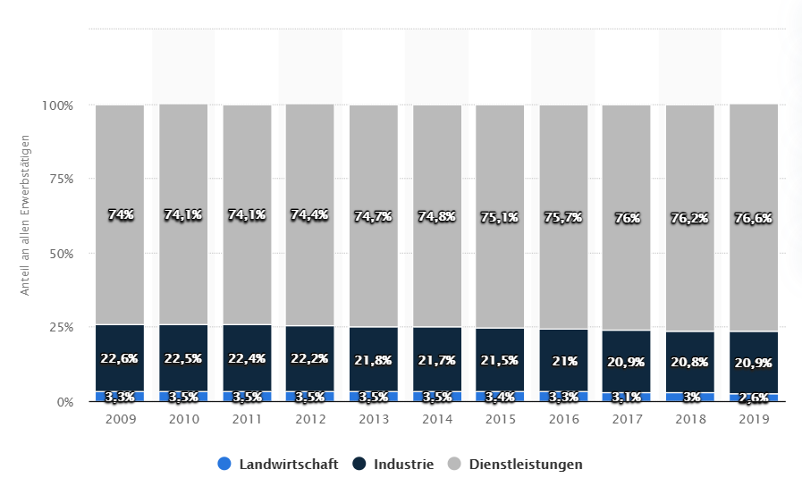
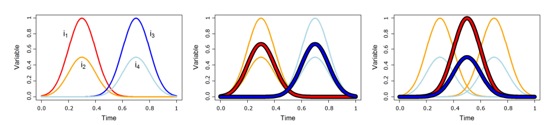

```{r global_options, include=FALSE}
knitr::opts_chunk$set(fig.pos = 'H', results = 'hide')
library(testthat)
color_block = function(color) {
  function(x, options) sprintf('\\color{%s}\\begin{verbatim}%s\\end{verbatim}',
                               color, x)
}
bg_block = function() {
  function(x, options) sprintf('\\begin{snugshade*}\\begin{verbatim}%s\\end{verbatim}\\end{snugshade*}', x)  
}
knitr::knit_hooks$set(error = bg_block())
library(testthat)
#library(testit)
#library(RUnit)
library(lubridate)
```
\listoftables
\listoffigures

\newpage
\pagenumbering{arabic}


# Abkürzungsverzeichnis

# Einleitung

## Ausgangslage
Die Verteilung der Beschäftigten hat sich in den letzten 200 jahren in den drei Wirtschaftssektoren, primär-, sekundär- und tertiärer Sektor, in der Schweiz massiv verändert. Im Tertiären Sektor, welchem Diensteleistungs- und Verwaltungsaufgaben zugeordnet werden von Banken, Versicherungen, Gastgewerbe, Handel und Verwaltungsarbeiten des Bundes, arbeiten über 70 Prozent der Arbeitnehmenden in der Schweiz. Da in diesem Sektor die meisten Arbeitnehmenden arbeiten, und das Risiko für einen tödlichen Unfall oder eine körperliche Verletzung geringer ist als in den anderen beiden Sektoren, spielt die Arbeitssicherheit immer weniger eine Rolle (Statista, 2010).



\begin{figure}
  \caption{Abbildung 1: Verteilung der Erwerbstätigen in der Schweiz nach Wirtschaftssektoren von 2009 bis 2019 (Statista, 2020)}
\end{figure}

\newpage

Dafür wird die psychische Gesundheit immer wichtiger. Die Arbeit ist geprägt durch hohe Eigenverantwortung und gibt den Arbeitnehmenden die Möglichkeit ihre die Arbeit individuell zu gestalten. Jedoch ist der Zusammenhang zwischen den damit verbundenen psychischen Belastungen im Wandel erkennbar. In den letzten Jahren, von 2006 bis 2015, hat die Anzahl an ambulant behandleten Personen in psychiatrischen Praxen stetig zugenommen (Schweizerisches Gesundheitsmonitoring, 2016). Dabei ist zu beachten, dass die Ursache dabei nicht allein beim Arbeitgeber liegt. Es können auch Faktoren einer Person aus der aktuellen Lebenslage dazu beitragen, dass psychische Störungen gefördert werden. Psychische Störungen können beispielsweise durch strukturelle Arbeitsbelastungen, wie die Anzahl Arbeitsstunden pro Woche oder das Betriebsklima entstehen. Die gegebenen Umstände durch die Arbeit und die spezifische Lebenslage einer Person stehen in Wechselwirkung zueinander und es kann zu gesundheitsgefährdenden Konstellationen kommen. Es können durch andauernd hohe psychische Belastungen nicht nur psychische Erkrankungen hervorgerufen werden, sondern auch körperliche Erkrankungen wie die Muskel-Skelett-Erkrankung (Costa & Vieira, 2010) oder Herz-Kreislauf-Erkrankungen (Backé et al., 2012). Die Folgen sind ausserdem Motivationsverluste, Arbeitsunzufriedenheit oder Leistungsabfall, welche zu einer verminderten Qualität in der geleisteten Arbeit führt. Ausserdem ist zu beachten, dass psychische Belastungen auf jeden Mitarbeitenden anders wirken und von mehreren Faktoren abhängig ist, beispielsweise die Fähigkeiten von Mitarbeitenden oder die Einstellung und Konstitution (S.28 Bundesanstalt für Arbeitsschutz und Arbeitsmedizin, 2014).

Die Bachelor Arbeit ist Teil des Schweizerischen National Fonds (SNF) Projekt: "Psychosoziale Risiken in der Arbeitswelt". Das SNF Projekt: "Psychosoziale Risiken in der Arbeitswelt" ist ein interdisziplinäres Grundlagenforschungsprojekt zwischen den Instituten IFSAR (Institut für Soziale Arbeit und Räume), dem IMS (Institut für Modellbildung und Simulation) und dem ICAS. In dem Projekt werden evidenzbasierte Gefährdungsbeurteilungen von Interdependenzen zwischen struktuellen Arbeitsbelastungen und subjektiv empfundenen Arbeitsbeanspruchungen herausgearbeitet. Die Erkenntnisse dieser Bachelor Arbeit dienen dem Projekt und helfen der Prävenzion von psychosozialen Gefährdungen. 

# Einbettung der Bachelorarbeit

## Fachwissenschaftlicher Kontext

Es gibt verschiedene Merkmalsbereiche wie der Arbeitsinhalt, die Arbeitsorganisation, soziale Beziehungen 
und Arbeitsumgebung. In den Merkmalsbereichen gibt es Belastungsfaktoren, welche negativ, aber auch 
positiv sein können und sich dem entsprechend auf die psychische Belastung des Arbeitnehmers auswirken 
können. Die richtigen Arbeitsbedingungen wirken positiv auf die Mitarbeitenden aus, in dem sie Einfluss auf 
die Motivation, die Arbeitszufriedenheit und die Leistungsfähigkeit nehmen. Ausserdem wirkt sich dies auch 
auf die wahrgenommene Attraktivität des Arbeitgebers aus (S.31 und S. 41, Bundesanstalt für Arbeitsschutz 
und Arbeitsmedizin, 2014)
Jede Person hat einen Verlauf des Depressionslevels oder der Ermüdung. Der Verlauf wird durch die 
Belastungsfaktoren beeinflusst. Doch wie unterscheiden sich die Belastungsfaktoren in den verschiedenen 
Verläufen? Mit Machine Learning (ML) ist es möglich aus einer quantitativen Datenerhebung, Cluster aus 
den verschiedenen Verläufen der Personen zu bilden. Um die Cluster zu erstellen wird ein unsupervised ML 
angewendet. Auch in diesem Teilbereich gibt es verschiedene Algorithmen, welche die Cluster nach 
unterschiedlichen Kriterien einteilen. In dieser Thesis werden k-means und kmlShape miteinander 
verglichen. K-means erzeugt Cluster aus den Verläufen, die sich am nächsten Befinden (Abbildung 1, 
mittleres Bild). KmlShape hingegen erstellt Cluster aus den Verläufen, die eine ähnliche Kontur haben
(Abbildung 1, rechtes Bild).


\begin{figure}
  \caption{Abbildung 2: Cluster longitudinal data according to their shapes (Chun-Hsi Huang, 2016)}
\end{figure}


KmlShape hat bei einer Untersuchung von Alzheimerverläufen einen neuen Verlauf gegenüber k-means 
aufgezeigt und hat damit zu neuen Erkenntnissen zum Krankheitsverlauf von Alzheimer verholfen (S.15 
Chun-Hsi Huang, 2016). Ähnliches könnte sich auch aus den Verläufen von Depression und Ermüdung 
ergeben. Um die Verläufe und deren Aussagekraft zu stützen, können die Belastungsfaktoren in den
Verläufen mit einer Fixed Effects Regressionsanalyse analysiert und verglichen werden. Daraus ergeben 
sich die Fragen: Welches der beiden Verfahren, k-means oder kmlShape, führt zu den besseren 
Ergebnissen und anhand von welchen Belastungsfaktoren wird dies bewertet? Auch stellt sich die Frage, 
wie viele Cluster sind ideal, damit diese aussagekräftig sind. Dazu kommt, lassen sich durch ML typische 
Verlaufsmuster finden und wenn ja, wie unterscheiden sich die Verläufe und wie lassen sich die Verläufe 
beschreiben?

## Anwendungsorientierter Kontext

«In einer Studie von Wieser et al. (2014) zu den «Kosten der nichtübertragbaren Krankheiten in der 
Schweiz» fällt auf, dass die psychischen Erkrankungen (10'638 Millionen Franken) nach den 
muskuloskelettalen Krankheiten (12’194 Millionen Franken) die höchsten indirekten Kosten für die 
Betroffenen bzw. die Gesellschaft aufweisen.» (S.59, Schweizerisches Gesundheitsobservatorium, 2016)
Im Bericht des schweizerischen Gesundheitsobservatoriums geht schnell hervor, welches Potenzial in der 
Forschung der psychischen Gesundheit noch verborgen ist. Durch die Vergleiche der Belastungsfaktoren in 
den Clustern und zwischen den Klustern können neue Risiken entdeckt werden, wodurch neue 
Massnahmen erarbeitet werden können, um die Risiken zu vermeiden. Ausserdem ist nicht ausgeschlossen, 
dass durch kmlShape ein noch unbekannter Verlauf entdeckt werden kann, was wiederrum auch zu neuen 
Erkenntnissen führt und damit auch zur Prävention beitragen kann. 
Durch die Massnahmen, welche aus den Erkenntnissen abgeleitet werden können, ist es möglich die 
betroffenen Personen vor psychischen und physischen Schäden und Folgen zu bewahren. Ausserdem 
könnten durch neue Massnahmen, Kosten vermieden werden, welche zu Lasten der Allgemeinheit sind.

## Zielsetzung

### Forschungsfrage

Können mit den beiden Verfahren, k-means und kmlShape, aussagekräftige Verläufe gefunden werden?
Welches der beiden Verfahren erzielt die besseren Resultate
Anhand von was wird dies bewertet?
Was ist die ideale Anzahl an Cluster?
Wie unterscheiden sich die Cluster innerhalb eines Verfahrens und wie unterscheiden sich Cluster zwischen 
den beiden Verfahren?
Wie lassen sich die Verlaufsmuster beschreiben (konstant, sinkt, steigt und warum)?
Kann mit kmlShape ein noch bisher unbekannter Verlauf entdeckt werden?

### Ziele der Arbeit

Die beiden Verfahren auf den neusten SHP-Datensatz anwenden und aussagekräftige Cluster zu erhalten.
Die Cluster vergleichen innerhalb eines Verfahrens und auch zwischen den Verfahren anhand von FE-Regressionsanalysen.
Die ideale Anzahl an Cluster für beide Verfahren.
Eine Bewertung der beiden Verfahren anhand der Ergebnisse.
Beschreibung der Verlaufsmuster und mit Begründung welche Belastungsfaktoren für den Verlauf 
verantwortlich sind.
Unbekannte Verläufe zu entdecken mit kmlShape.

### Ergebnisse der Arbeit

i) Die Erkenntnis, ob die gewählten Verfahren dazu im Stande sind aussagekräftige unbekannte 
sowie bekannte Verläufe zu finden.
ii) Ist Punkt i) erreicht, die Unterschiede zwischen den Clustern.
iii) Bewertung der beiden Verfahren.

## Abgrenzung

## Methodisches Vorgehen

Wissensstand über bisherige Verläufe von Depression und Ermüdung aufarbeiten, um bewerten zu können 
ob die Verfahren dazu im Stande sind bekannte aussagekräftige Verläufe zu finden und in einem weiteren 
Schritt unbekannte und bekannte Verläufe voneinander unterscheiden zu können.
Wissen und Funktion über die beiden Verfahren, k-means und kmlShape, aneignen, um die Verfahren 
später besser bewerten zu können und Unterschiede in ähnlichen Verläufen damit erklären zu können.
Den Datensatz des schweizerischen Haushaltspanels in R einlesen und mit dem Clustering beginnen, um 
die Cluster zu bewerten und die ideale Anzahl an Verläufen feststellen zu können damit in einem weiteren 
Schritt die Cluster, und damit auch die Verfahren, verglichen werden können. Daraus werden die Kluster 
sich auch beschreiben lassen. Aus den Vergleichen werden die Unterschiede hervorgehen und damit 
werden sich auch die Verlaufsmuster begründen lassen, sowie innerhalb aber auch zwischen den Verfahren. 
In diesem Prozess wird sich herausstellen, welche Kriterien zur Bewertung der beiden Verfahren genutzt 
werden.

# Beschreibung der verschiedenen Methodiken

## Beschreibung von Unsupervised (k-means, kml.Shape)

Wie oben schon erwähnt kommen die beiden unsupervised Verfahren k-means und kml.Shape zum einsatz. In diesem 


## Beschreibung der angewendeten Regressionstechniken (fixed Effects)

# Beschreibung der verwendeten Variablen

# Erstellen und analysieren der Cluster mit den beiden Verfahren

# Bewertung der Verfahren

# Resultate

## Resultate in Bezug auf Sozialwissenschaften

# Zielüberprüfung

# Schlussfolgerung

# a. Literaturverzeichnis

# b. Anhänge
