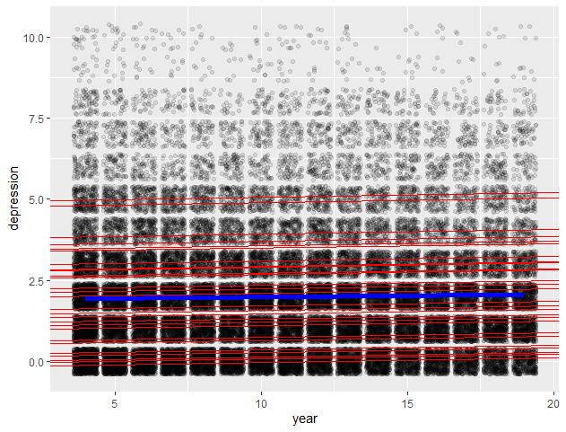
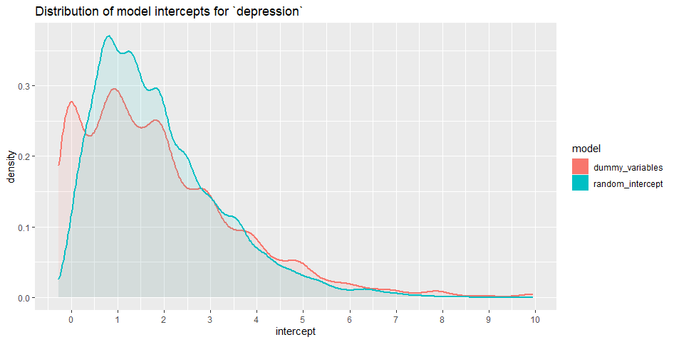

```{=html}
<style type="text/css">

body, td {
   font-size: 13px;
   text-align: justify;
   <!-- font: Courier New -->
}
pre {
  font-size: 12px
}

div.blue { 
  background-color:#e6f0ff; 
  border-radius: 5px; 
  padding: 20px;
}

</style>
```


```{r setup, include=FALSE}
imsbasics::clc()
source("../00_functions.R")

library(tidyverse)
library(shp)
library(plotly)
library(multilevelTools)
library(lme4)
library(lmerTest)
library(sjPlot)
library(broom.mixed) # very important, because otherwise modelsummary::get_estimates() won't recognize 
                     # the random effects when rendering the Rmd. The S3-Method "tidy.gamlss" needs
                     # to be overwritten by the "broom.mixed"-package to fix this isue. 

                     
options(width = 110) # goes optimal with pre font-size in html-chunk above
knitr::opts_chunk$set(echo = TRUE, fig.width = 10)
# Set render-directory to project-directory (important for loading of data in this RMD) 
# source: https://stackoverflow.com/questions/30237310/setting-work-directory-in-knitr-using-opts-chunksetroot-dir-doesnt-wor 
knitr::opts_knit$set(root.dir = rprojroot::find_rstudio_root_file())
```


```{r}
df <- imsbasics::load_rdata("sample.RData", "Scripts_Michi/model_playground/")
```

# Intro 

In this script I want to play around with the `lme4::lmer()` function. 

 - analyse the sample-Dataset (state-of-the art shp-import on 15.04.2021 -> see `2021_03_18-outlier_analysis.html`)
 - evaluate fixed & random effects 
 - get to know the lme4 package better 


Data

 * drop entries with invalid values for `alter` and 
 * only look at individuals between `age` 15 and 65 
 * only look at individuals with `occupa` in 1,2,3,5,6: 
    * **1 "Bezahlte Erwerbstätigkeit, vollzeit (reguläre Arbeitszeit 37 Stunden pro Woche oder mehr)"**
    * **2 "Bezahlte Erwerbstätigkeit, teilzeit (reguläre Arbeitszeit 5-36 Stunden pro Woche)"**
    * **3 "Bezahlte Erwerbstätigkeit, teilzeit (1 - 4 Stunden / Woche)"**
    * 4 "In Ausbildung (Lehrling, Schüler/In, Student/In)"
    * **5 "Mitarbeit im Familienbetrieb"**
    * **6 "Arbeit in geschützter Werkstatt (für Behinderte, Personen mit Problemen)"**
    * 7 "Kind/Frau/Mann im Haushalt (nur bis maximal 64 bzw. 65 Jahre)"
    * 8 "Rentner (AHV)"
    * 9 "Rentner, (IV usw.)"
    * 10 "Arbeitslos"
    * 11 "Andere Tätigkeit (Weiterbildung, unbezahlter Urlaub)"


> we have `r nrow(df)` rows (`r length(unique(df$id))` unique individuals) and `r ncol(df)` columns.  
  


The column "year" needs to be transformed to numeric values. 
```{r}
table(sapply(X = df, FUN = class))
which(sapply(X = df, FUN = class) == "character")
df$year <- as.numeric(df$year)
```


```{r}
# We want to visualize the development of `depression` over time for the first 100 people
# we Add NA's to have nice separated lines (per person)
ind_add_NA <- which(!duplicated(df$id))[1:100]
ind_add_NA[1] <- 0
df2 <- berryFunctions::insertRows(as.data.frame(df[1:max(ind_add_NA),]), r = ind_add_NA, 
                                  new= NA, rcurrent = TRUE)
plot_ly(df2, x = ~year, y = ~id, z =~depression,
        type = "scatter3d", mode = "lines", 
        color = ~depression, 
        colors = colorRamp(c("darkgreen", "darkorange", "red")), 
        size = I(4)) %>% 
  layout(title = "Development of `depression` for first 100 Individuals",
         scene = list(camera = list(
           eye = list(x = -4, y = -5, z = 3),
           # up = list(x = 0, y = 0, z = 1)
           center = list(x = 0, y = 0, z = -0.5)
         ),
         aspectmode = "manual", aspectratio = list(x=1, y=5, z=1)
         ))
```


# Analysis `depression` {.tabset}

We see that for `depression` we have a lot of variance between the subjects , and nearly
as much variance within the subjects.

```{r}
knitr::kable(multilevelTools::iccMixed(dv = "depression", id = "id", data = df), align = "lll")
tmp <- multilevelTools::meanDecompose(depression ~ id, data = df)
# str(tmp, nchar.max = 30)
```

## between
On a significance level of $\alpha = 0.001$, we see some individuals that can
be seen as extreme values (depression ~ 7 and higher). Ecaclty these cases are interesting
for us.
```{r}
plot(JWileymisc::testDistribution(tmp[["depression by id"]]$X, extremevalues = "theoretical", ev.perc = .001),
     varlab = "Between Person depression")
```


## within
The within person variance of `depression` is very sharp -> many people don't show
a lot of variance. Here we are interested in the outliers, because they show extreme
within-changes of `depression`.
```{r}
plot(JWileymisc::testDistribution(tmp[["depression by residual"]]$X, extremevalues = "theoretical", ev.perc = .001),
     varlab = "Within Person depression")
```


## Correlations

Is there possible collinearity between depression and other variables? 

```{r}
dep_covariance <- var(df, na.rm = TRUE, use = "pairwise.complete.obs") # calculate variances & covariances
dep_correaltion <- cov2cor(dep_covariance)
corrplot::corrplot(dep_correaltion, method = "ellipse", cl.pos = "r")

par(mar = c(15, 4, 4, 2) + 0.1)
xx <- barplot(dep_correaltion["depression",], las = 2, ylim = c(-0.4,1),
              main = "Correlation of other Varaibles with `depression`")
text(xx, 1.2*dep_correaltion["depression",], cex = 0.8,
     labels= round(dep_correaltion["depression",], 2))
```


# Analysis of independent variables {.tabset}

```{r, results='asis', fig.height=4}
# cols <- names(df)[!names(df) %in% c("depression", "id")]
# 
# # for (i in cols[1:3]) {
# for (i in cols) {
#   cat("\n\n## ",i, "{.tabset}\n\n\n")
#   barplot(table(df[,i]), main = paste0("Verteilung aller Einträge von '",i,"'"), las = 2)
#   cat("\n\n")
#   print(knitr::kable(multilevelTools::iccMixed(dv = i, id = "id", data = df), align = "lll"))
# 
#   tmp <- multilevelTools::meanDecompose(as.formula(paste(i, "~ id")), data = df)
# 
#   cat("\n\n### between \n\n")
#   plot(JWileymisc::testDistribution(tmp[[paste(i, "by id")]]$X, extremevalues = "theoretical", ev.perc = .001),
#        varlab = paste("Between Person", i))
# 
#   cat("\n\n### within \n\n")
#   plot(JWileymisc::testDistribution(tmp[[paste(i, "by residual")]]$X, extremevalues = "theoretical", ev.perc = .001),
#      varlab = paste("Within Person", i))
# }
```


# Models (lmer / glmer)

 * fi = fixed intercept 
 * ri = random intercept 
 * fs = fixed slope 
 * rs = random slope 

<style>
div.blue { background-color:#e6f0ff; border-radius: 5px; padding: 20px;}
</style>
<div class = "blue">

**Copied from `?lme4::checkConv()`**

[g]lmer fits may produce convergence warnings; these do not necessarily mean the fit is incorrect (see “Theoretical details” below). The following steps are recommended assessing and resolving convergence warnings (also see examples below):

 * double-check the model specification and the data
 * adjust stopping (convergence) tolerances for the nonlinear optimizer, using the optCtrl argument to [g]lmerControl (see “Convergence controls” below) 
 * center and scale continuous predictor variables (e.g. with scale)
 * double-check the Hessian calculation with the more expensive Richardson extrapolation method (see examples)
 * restart the fit from the reported optimum, or from a point perturbed slightly away from the reported optimum
 * use allFit to try the fit with all available optimizers (e.g. several different implementations of BOBYQA and Nelder-Mead, L-BFGS-B from optim, nlminb, ...). While this will of course be slow for large fits, we consider it the gold standard; if all optimizers converge to values that are practically equivalent, then we would consider the convergence warnings to be false positives.  
</div><br/>


# ----------lmer: m0 - intercept ---------

# m0_fi: `dep ~ 1` {.tabset}

**Fixed intercept.**
This model equals `mean(df$depression, na.rm = TRUE)` = `r mean(df$depression, na.rm = TRUE)`

## Model
```{r}
m0_fi <- lm(depression ~ 1, data = df)
coeff_table <- add_model_to_coeff_table(m0_fi)
summary(m0_fi)
```

## Scatterplot

```{r}
ggplot(df, aes(x = 1, y = depression)) +
  geom_point(alpha = 0.2, position = "jitter") +
  geom_hline(yintercept = mean(df$depression, na.rm = TRUE), col = "blue", size = 2) + 
  theme(axis.title.x = element_blank(), 
        axis.text.x = element_blank(), 
        axis.ticks.x = element_blank())
```


# m0_fi_ri: `dep ~ 1 + (1|id)` {.tabset}

**Random intercept.**  
We only investigate the variation of the variable `depression` around the fixed mean 
per individual. Therefore we account for the individual levels of `depression` for each 
individual. If we later use other predictors (fixed or random), the term `(1|id)` will account 
for individual differences ("between"-differences, which are neglected in FE-Models by demeaning) 

## Model
```{r}
m0_fi_ri <- lmer(depression ~ 1 + (1|id), data = df, REML = FALSE)
# m0_fi_ri <- lmer(depression ~ (1|id), data = df, REML = FALSE) # identical model
print(class(m0_fi_ri))
modelsummary::get_estimates(m0_fi_ri)
coeff_table <- add_model_to_coeff_table(m0_fi_ri, coeff_table)

summary(m0_fi_ri)
```

## Scatterplot

```{r}
individual_means <- df %>% group_by(id) %>% summarise(mean_depression = mean(depression))

ggplot(df, aes(x = 1, y = depression)) +
  geom_point(alpha = 0.2, position = "jitter") +
  geom_hline(yintercept = summary(m0_fi_ri)$coefficients["(Intercept)", "Estimate"], col = "blue", size = 2) + 
  geom_hline(yintercept = individual_means$mean_depression[1:40], col = "red", size = 0.5) + 
  theme(axis.title.x = element_blank(), 
        axis.text.x = element_blank(), 
        axis.ticks.x = element_blank())
```


## Analysis of Model {.tabset}

Is the model singular (i.e. are the parameters on the boundary of the feasible parameter space)? 
```{r}
isSingular(m0_fi_ri)
```

### Random Intercept 
```{r}
plot_model(m0_fi_ri,type="re",sort.est = T, grid=F) # only a random intercept

ggplot(as.data.frame(ranef(m0_fi_ri)$id), aes_string(x = "`(Intercept)`")) +
  ggtitle("Distribution of Random Intercept for 'id'") +
  geom_density() + 
  scale_x_continuous(breaks = seq(-10, 10, 1), limits = c(-4,10))
```


### Random Intercept vs. individual means

 * individual means (-> explicit modelling)
 * random intercept (-> implicit integration with bayesian shrinkage towards mean of data)
 

```{r}
m0_comparison_1 <- data.frame(model = "random_intercept",
                              intercept =  ranef(m0_fi_ri)$id[,1] + summary(m0_fi_ri)$coefficients["(Intercept)","Estimate"])
m0_comparison_2 <- data.frame(model = "individual_means",
                             intercept = individual_means$mean_depression)

m0_comparison <- rbind(m0_comparison_1, m0_comparison_2); rm(m0_comparison_1, m0_comparison_2)

ggplot(data = m0_comparison, mapping = aes(x = intercept, col = model)) +
  ggtitle("Distribution of model intercepts for `depression`") +
  # geom_histogram(aes(y=..density..)) +
  geom_density(aes(fill = model, alpha = I(0.1), size = I(1))) +
  scale_x_continuous(breaks = seq(-10, 10, 1))
```


# ----------lmer: m1 - year ----------------

# m1_fi_fs: `dep ~ 1 + year` {.tabset}

**Fixed intercept + fixed slope.**
Total `depression` increases over time, BUT the relevance of the model is neglectable
($\rightarrow$ adj. R-squared $\approx 0.0004$)

## Model
```{r}
m1_fi_fs <- lm(depression ~ year, data = df)
coeff_table <- add_model_to_coeff_table(m1_fi_fs, coeff_table)
summary(m1_fi_fs)
```

## Scatterplot
```{r}
ggplot(df, aes(x = year, y = depression)) +
  geom_point(alpha = 0.1, position = "jitter") +
  theme(legend.position = "none") +
  # geom_line(mapping = aes(x = year, y = depression, color = as.factor(id)),
  #           stat="smooth", method = "lm", alpha = 1, size = 0.4) +
  geom_line(stat="smooth", method = "lm", alpha = 1, size = 2, color = "blue")
```


# m1_fi_ri_fs: `dep ~ 1 + (1|id) + year` {.tabset}

**Random intercept + fixed slope.**
If we don't allow for individual changes of `depression` over time (see next models
with random slopes), the standard-deviation on the individual (random) intercept
is smaller than in the following models with random slope ($1.476 < 1.747$ ). 

## Model
```{r}
m1_fi_ri_fs <- lmer(depression ~ 1 + (1|id) + year, data = df, REML = FALSE)
coeff_table <- add_model_to_coeff_table(m1_fi_ri_fs, coeff_table)
summary(m1_fi_ri_fs)
```


## Scatterplot

takes about 1h to run -> only run for final Version.


```{r}
# takes about 1h

# m1_fi_ri_fs_dummy <- lm(depression ~ as.factor(id) + year, data = df)
# dummy_slope <- m1_fi_ri_fs_dummy$coefficients["year"]
# dummy_intercepts <- c(m1_fi_ri_fs_dummy$coefficients["(Intercept)"],
#                       m1_fi_ri_fs_dummy$coefficients["(Intercept)"] +
#                       m1_fi_ri_fs_dummy$coefficients[grepl("as.factor", names(m1_fi_ri_fs_dummy$coefficients))])
#
# ggplot(df, aes(x = year, y = depression)) +
#   geom_point(alpha = 0.1, position = "jitter") +
#   theme(legend.position = "none") +
#   # geom_line(mapping = aes(x = year, y = depression, color = as.factor(id)),
#   #           stat="smooth", method = "lm", alpha = 1, size = 0.4) +
#   geom_line(stat="smooth", method = "lm", alpha = 1, size = 2, color = "blue") +
#   geom_abline(intercept = dummy_intercepts[1:30], slope = dummy_slope, col = "red", size = 0.5)
```

## Analysis of Model {.tabset}

Is the model singular (i.e. are the parameters on the boundary of the feasible parameter space)?
```{r}
isSingular(m1_fi_ri_fs)
```

### Random Intercept
```{r}
plot_model(m1_fi_ri_fs,type="re",sort.est = T, grid=F) # only a random intercept

ggplot(as.data.frame(ranef(m1_fi_ri_fs)$id), aes_string(x = "`(Intercept)`")) +
  ggtitle("Distribution of Random Intercept for 'id'") +
  geom_density() +
  scale_x_continuous(breaks = seq(-10, 10, 1), limits = c(-4,10))
```


### Random Intercept vs. Dummy-variables

 * dummy-variables (-> explicit modelling)
 * random intercept (-> implicit integration with bayesian shrinkage towards mean of data)

The difference of theses two "kinds" of Intercepts gives a quantifiaction of the
Bayesian shrinkage in this context.
There are two good reasons to prefer random intercepts over LSDV (dummy-variable models):

 1. It's much faster (@Michi -> quantify... LSDV - ca. 1h / Random Intercept - ca. 1sec)
 2. It's more representative of the implicit data-strucutre (shrinkage towards mean of the whole sample)



```{r}
# m1_comparison_1 <- data.frame(model = "random_intercept",
#                               intercept = ranef(m1_fi_ri_fs)$id[,1] + summary(m1_fi_ri_fs)$coefficients["(Intercept)","Estimate"])
# m1_comparison_2 <- data.frame(model = "dummy_variables",
#                              intercept = as.numeric(dummy_intercepts))
#
# m1_comparison <- rbind(m1_comparison_1, m1_comparison_2); rm(m1_comparison_1, m1_comparison_2)
#
# ggplot(data = m1_comparison, mapping = aes(x = intercept, col = model)) +
#   ggtitle("Distribution of model intercepts for `depression`") +
#   # geom_histogram(aes(y=..density..)) +
#   geom_density(aes(fill = model, alpha = I(0.1), size = I(1))) +
#   scale_x_continuous(breaks = seq(-10, 10, 1))
```


### Slope (?)
```{r}
plot_model(m1_fi_ri_fs, type=c("slope"), sort.est=T, grid=F) # slope
```


# m1_fi_ri_rs: `dep ~ 1 + (year|id)` {.tabset}
**Random intercept**

## Model {.tabset}

The Model first gives some convergence warnings, but all 7 standard-optimize algorithms
converge to nearly identical results. Therefore we can see the error messages as
false positives.

### Fitting with `allFit`

```{r,warning=FALSE}
m1_fi_ri_rs <- lmer(depression ~ 1 + (year|id), data = df, REML = FALSE)
coeff_table <- add_model_to_coeff_table(m1_fi_ri_rs, coeff_table)
summary(m1_fi_ri_rs)
```

```{r,warning=FALSE}
# m1_fi_ri_rs_rs <- lmer(depression ~ year + (year|id), data = df, REML = FALSE, control = lmerControl(optimizer ="bobyqa"))
# m1_fi_ri_rs_rs <- lmer(depression ~ year + (year|id), data = df, REML = FALSE, control = lmerControl(optimizer ="Nelder_Mead"))
m1_fi_ri_rs_all <- allFit(m1_fi_ri_rs)
ss <- summary(m1_fi_ri_rs_all)
knitr::kable(ss$which.OK)
```


### Parameters

Fixed Effects:
```{r}
knitr::kable(ss$fixef)
```

Random Effects parameters (Cholesky scale):
```{r}
knitr::kable(ss$theta)
```

Random effec SD's & correlations:
```{r}
knitr::kable(ss$sdcor)
```

## Scatterplot
Not interesing ...


## Analysis of Model {.tabset}

### Random Intercept & random slope
```{r}
plot_model(m1_fi_ri_rs, type="re",sort.est = T, grid=F) # random intercept & random slope

ggplot(as.data.frame(ranef(m1_fi_ri_rs)$id), aes_string(x = "`(Intercept)`")) +
  ggtitle("Distribution of Random Intercept for 'id'") +
  geom_density() +
  scale_x_continuous(breaks = seq(-10, 10, 1), limits = c(-4,10))

ggplot(as.data.frame(ranef(m1_fi_ri_rs)$id), aes_string(x = "year")) +
  ggtitle("Distribution of Random slope for year ('id')") +
  geom_density()

```

### Slope (?)
```{r}
plot_model(m1_fi_ri_rs, type=c("slope"), sort.est=T, grid=F) # slope
```


# m1_fi_ri_fs_rs: `dep ~ 1 + year + (year|id)` {.tabset}

**Random intercept + random slope.**
If we allow for individual changes of `depression` over time, the standard-deviation
on the individual (random) intercept decreases -> and we get a random slope (accounting
for individual changes over time)

First the Model fails to converge:

 * [Inputs on Convergence](https://stats.stackexchange.com/questions/242109/model-failed-to-converge-warning-in-lmer)
 * [Inputs on ML & REML](https://stats.stackexchange.com/questions/48671/what-is-restricted-maximum-likelihood-and-when-should-it-be-used)


## Model {.tabset}

The Model first gives some convergence warnings, but all 7 standard-optimize algorithms
converge to nearly identical results. Therefore we can see the error messages as
false positives.

### Fitting with `allFit`

```{r, warning=FALSE}
m1_fi_ri_fs_rs <- lmer(depression ~ year + (1 + year|id), data = df, REML = FALSE)
coeff_table <- add_model_to_coeff_table(m1_fi_ri_fs_rs, coeff_table)
summary(m1_fi_ri_fs_rs)
```

```{r, warning=FALSE}
# m1_fi_ri_fs_rs <- lmer(depression ~ year + (year|id), data = df, REML = FALSE, control = lmerControl(optimizer ="bobyqa"))
# m1_fi_ri_fs_rs <- lmer(depression ~ year + (year|id), data = df, REML = FALSE, control = lmerControl(optimizer ="Nelder_Mead"))
m1_fi_ri_fs_rs_all <- allFit(m1_fi_ri_fs_rs)
ss <- summary(m1_fi_ri_fs_rs_all)
knitr::kable(ss$which.OK)
```

### Parameters

Fixed Effects:
```{r}
knitr::kable(ss$fixef)
```

Random Effects parameters (Cholesky scale):
```{r}
knitr::kable(ss$theta)
```

Random effec SD's & correlations:
```{r}
knitr::kable(ss$sdcor)
```


## Scatterplot
Not interesing ...


## Analysis of Model {.tabset}

### Random Intercept & random slope
```{r}
plot_model(m1_fi_ri_fs_rs,type="re",sort.est = T, grid=F) # random intercept & random slope

ggplot(as.data.frame(ranef(m1_fi_ri_fs_rs)$id), aes_string(x = "`(Intercept)`")) +
  ggtitle("Distribution of Random Intercept for 'id'") +
  geom_density() +
  scale_x_continuous(breaks = seq(-10, 10, 1), limits = c(-4,10))

ggplot(as.data.frame(ranef(m1_fi_ri_fs_rs)$id), aes_string(x = "year")) +
  ggtitle("Distribution of Random slope for year ('id')") +
  geom_density()

```


### Slope (?)
```{r}
plot_model(m1_fi_ri_fs_rs, type=c("slope"), sort.est=T, grid=F) # slope
```


# --------------------------------------------
# Summary {.tabset}

```{r}
print(nrow(coeff_table))
knitr::kable(coeff_table, format = "simple")
```

Parameter Estimates with standard errors: 

 * `(Intercept)` = fixed effect estimate for the intercept 
 * `year` = fixed effect estimate for `year`

 * `sd__Observations` = Standard Deviation of Residuals 
 * `sd__(Intercept)` = random effect on intercept
 * `sd__year` = random effect on `year`
 * `cor__(Intercept).year` = correlation of random intercept and `year` 

```{r}
library(modelsummary)
modelsummary::modelsummary(list(m0_fi = m0_fi, 
                                m0_fi_ri = m0_fi_ri, 
                                m1_fi_fs = m1_fi_fs, 
                                m1_fi_ri_fs = m1_fi_ri_fs, 
                                m1_fi_ri_rs = m1_fi_ri_rs, 
                                m1_fi_ri_fs_rs = m1_fi_ri_fs_rs), 
                           estimate = "{estimate} ({std.error})", 
                           statistic = NULL
                           # coef_omit = "cor__"
                           )
```

Results: 

We see in this simple models, that: 

 * Random Effect on Residuals is higher than on Intercept --> The error we make is 
 (on average) smaller than the individual offset. We can't conclude that for individuals, 
 because we only look at the mean deviation (random effect). BUT it gives us a hint, 
 that the general magnitude of our estimation-errors is about the same (even smaller) 
 than the error on the intercepts. 
 * If we incoorporate `year` the models become slightly better (although `year` might 
 be a bad predictor for the individual, beause there is severe fluctuation for individuals)
 * The more variables (fi, ri, fs, rs) we incorporate, the higher the effect of 
 `year` -> this doesn't necessarily mean something. 
 * Correlation between random intercept and random slope is about -0.56 --> quite big... 
 This means: The lower/higher the start value (intercept) of a person, the higher/lower 
 the effect of year (on average).
   * People who have a low starting value tend to vary more over time. 
   * People woh have a high starting value tend to vary less over time.


# --------------------------------------------

# Plot Models {.tabset}

[https://strengejacke.github.io/sjPlot/articles/plot_marginal_effects.html](https://strengejacke.github.io/sjPlot/articles/plot_marginal_effects.html)

We plot the prediction depending on different predictors.

<style>
div.blue { background-color:#e6f0ff; border-radius: 5px; padding: 20px;}
</style>
<div class = "blue">
The terms-argument accepts up to three model terms, where the second and third term indicate grouping levels. This allows predictions for the term in question at different levels for other model terms
</div><br/>

## FE- & RE-coefficients

```{r}
m10_ri_fs <- lmer(depression ~ year + stress_arbeit + nachtarbeit + (1|id),
                  data = df, REML = FALSE)
# summary(m10_ri_fs)
plot_model(m10_ri_fs, type = "est", sort.est = T, show.values = TRUE, value.offset = .3)
plot_model(m10_ri_fs, type = "re", sort.est = T, grid=F)
```


## Marginal Effects & Means
Marginal Effects look at specific levels of focal variables
```{r}
plot_model(m10_ri_fs, type = "pred", terms = c("year", "stress_arbeit"))
plot_model(m10_ri_fs, type = "pred", terms = c("year", "stress_arbeit", "nachtarbeit"))
```

Similar to type = "pred", however, discrete predictors are held constant at their proportions (not reference level). See ggeffect for details.

```{r}
plot_model(m10_ri_fs, type = "eff")
# plot_model(m10_ri_fs, type = "emm")
```

Marginal effects on interactions
```{r}
# plot_model(m10_ri_fs, type = "int")
```

## slope
```{r}
plot_model(m10_ri_fs, type = "slope")
```

## resid

```{r}
plot_model(m10_ri_fs, type = "resid")
```

## diag
check model assumptions
```{r}
plot_model(m10_ri_fs, type = "diag")
```


# --------------------------------------------
# Compare Models

See [https://cran.r-project.org/web/packages/lmerTest/lmerTest.pdf](https://cran.r-project.org/web/packages/lmerTest/lmerTest.pdf)

 * `lmerTest::ranova()` ?
 * `lmerTest::drop1()` ?
 * `lmerTest::contest()` ?
 * `lmerTest::show_test()` ?

 * `car::vif()` --> test for collinearity issues of a model (see MPM-2, 2nd semester)

 * `lme4::mcmcsamp()` -> see "Generalised Linear Mixed Models and its Application in R" by **James Dawber**
