<!-- Quelle: https://gist.github.com/Pakillo/8b46a48ea806572566d9 -->

<!-- Quelle - Columns: https://bookdown.org/yihui/rmarkdown-cookbook/multi-column-layout.html -->

```{=html}
<style type="text/css">

body, td {
   font-size: 14px;
   text-align: justify;
   <!-- font: Courier New -->
}
pre {
  font-size: 12px
}

div.blue { 
  background-color:#e6f0ff; 
  border-radius: 5px; 
  padding: 20px;
}

</style>
```


```{r setup, include=FALSE}
library(shp)
library(tidyverse)
library(kml)
library(dplyr)
library(randomForest)
library(tree)
# Set messages to "false" in order to neglect import messages.
knitr::opts_chunk$set(echo = TRUE, message = FALSE, fig.height = 4)
# Set render-directory to project-directory (important for loading of data in this RMD) 
# source: https://stackoverflow.com/questions/30237310/setting-work-directory-in-knitr-using-opts-chunksetroot-dir-doesnt-wor 
knitr::opts_knit$set(root.dir = rprojroot::find_rstudio_root_file())
# set load- and save-paths for faster loading of data
load_path <- paste0(getwd(),"/")
save_path <- load_path
```

<br><br><br><br><br><br><br>

# Adi's Preliminary Work

Zusammenfassung der Vorarbeiten von Adrian Stämpfli (vgl.
/Scripts_Adrian/ -\> Stand: 25.02.2021) 

Used methods: 

 * lm (glm) -> in "Data Analysis"
 * kmeans-clustering -> in "Data Analysis" 
 * kml -> in "kml" 
 * random forest -> in "kml" -> `200902-script-schritt2-random-forrest.R`
 * arules -> in "kml" -> `200908-script-schritt2-arules.R` 
 * lme4::lmer() -> `200922-script-fixed-effects.R`
 * plm::plm() -> `200923-rmd-fixed-effects-plm-depression-erschoepfung.Rmd` 
 * vcrpart::tvcglm() -> `200928-script-vcrpart.R` (package not available)

## Data Analysis

### 200414-script-stress-over-time.R

Sum of Stress for all complete cases in Years 2004 - 2018 (960 of 14'081
cases are complete)

```{r}
# stress <- import_long_cols("P_USER.sav", "data/rawdata/Data SPSS/SHP-Data-W1-W21-SPSS",
#                            cols = c("IDPERS", "PYYW604"), year_start = "2004", year_end = "2018")
# imsbasics::save_rdata(stress, "stress", save_path, force = TRUE)
stress <- imsbasics::load_rdata("stress", load_path)
stress_complete <- stress %>% filter(complete.cases(.))
colSums(stress_complete)
plot(seq(2004,2018), colSums(stress_complete)[2:16], type = "l",
     ylab = "Total Stress")
```

### 200414-script-work-life-balance.R

Work life Balance of first 10 complete cases in years 2004 - 2018 (946
of 14'081 cases are complete).

```{r}
# wlb <- import_long_cols("P_USER.sav", "data/rawdata/Data SPSS/SHP-Data-W1-W21-SPSS",
#                         cols = c("IDPERS", "PYYF50"), year_start = "2004", year_end = "2018")
# imsbasics::save_rdata(wlb, "wlb", save_path, force = TRUE)
wlb <- imsbasics::load_rdata("wlb", load_path)

wlb_complete <- wlb %>% filter(complete.cases(.))
wlb_complete_long <- wlb_complete %>%
  pivot_longer(cols = starts_with("P"), names_to = "year") %>%
  mutate(year = as.numeric(str_sub(year, 2, 3)))

# first 10 persons
ids <- unique(wlb_complete_long$ID)[1:10]
wlb_complete_long_10 <- wlb_complete_long %>% filter(ID %in% ids)
ggplot(data = wlb_complete_long_10, aes(x = year, y = value, group = ID)) +
  geom_line(aes(color = as.factor(ID))) +
  ggtitle("Work Life Balance over time (Variable F50; 2004 - 2018)")
```

### 200414-so-longitudinal-data.R

Merge dataframes using recuce-functionalities...

```{r}
df1 <- data.frame(id = 1:5, var_a = 1:5)
df2 <- data.frame(id = 6:3, var_a = 2:5)
df3 <- data.frame(id = c(2,4,5), var_a = 3)
# df <- merge(df1, df2, all = TRUE)
# df
# df <- merge(df, df3, all = TRUE)
# df

df <- data.frame(id = c(4,5), var_a_df1 = c(4,5), var_a_df2 = c(4,3), var_a_df3 = c(3,3))
df

# https://stackoverflow.com/questions/8091303/simultaneously-merge-multiple-data-frames-in-a-list
Reduce(function(x, y) merge(x, y, by = 'id'), list(df1, df2, df3))

library(tidyverse)
list(df1, df2, df3) %>% reduce(left_join, by = "id") %>% filter(complete.cases(.))
```


### 200504-so-dplyr.R

Playaound with `dplyr`

```{r}
# library(dplyr)
df <- data.frame(cluster = c("A", "A", "B", "A", "B"), age = c(1:5))

my_summarise_manual <- function(df) {
  df %>% group_by(cluster) %>% summarise(age := mean(age))
}
my_summarise_manual(df)

my_group_manual <- function(df) {
  df %>% group_by(cluster)
}
my_group_manual(df)

my_group_1 <- function(df, a) {
  a <- enquo(a)
  df %>% group_by(!!a)
}
my_group_1(df)

my_summarise_1 <- function(df, a, b) {
  df %>% group_by(!!a) %>% summarise(!!b := mean(!!b))
}

my_summarise_2 <- function(df, a, b) {
  a <- enquo(a)
  b <- enquo(b)
  df %>% group_by(!!a) %>% summarise(!!b := mean(!!b))
}
my_summarise_2(df, cluster, age)
```


### 200506-so-year.R

Function to extract `year` in an arrangement of text and numbers.

```{r}
y1 <- "AB99"
y2 <- "04CD"
y3 <- "X90Z"
y4 <- "EF09"
y5 <- "12GH"

cat("\n", y1, ", ", y2, ", ", y3, ", ", y4, ", ", y5, ", ")

fun <- function(x) {
  year <- readr::parse_number(x)
  if(year < 50) year <- paste0("20", year) else year <- paste0("19", year)
  return(year)
}

cat("\n", fun(y1), ", ", fun(y2), ", ", fun(y3), ", ", fun(y4), ", ", fun(y5), ", ")


fun <- function(x) {
  num <- gsub("\\D", "", x)
  return(paste0(ifelse(num >= "90", "19", "20"), num))
}
cat("\n", fun(y1), ", ", fun(y2), ", ", fun(y3), ", ", fun(y4), ", ", fun(y5), ", ")

fun <- function(x) {
  year <- readr::parse_number(x)
  if (year < 50) {
    year <- paste0("20", stringr::str_pad(year, 2, side="left", "0"))
  } else {
    year <- paste0("19", year)
  }
  return(year)
}
cat("\n", fun(y1), ", ", fun(y2), ", ", fun(y3), ", ", fun(y4), ", ", fun(y5), ", ")

# https://stackoverflow.com/questions/61654975/parse-string-extract-two-digit-year-and-complete-into-four-digit-format

```


### 200723-script-correlation-bbb.R {.tabset}

#### 1st try

We want to compare (look for connections) between `Autonomie` &
`Selbstwirksamkeitserwartung` and use all data from `W17_2015`.

 * P15C70 = Self-Perception : incapacity to make plans because of unpredictability (~ Selbstwirksamkeitserwartung)
 * P15W91 = CMJ: Job with participation in decision making (~ Autonomie)
 * SEX15 = Sex

```{r}
aut_vs_sel <- import_cols("SHP15_P_USER.sav", "data/rawdata/Data SPSS/SHP-Data-W1-W21-SPSS/W17_2015",
                          cols = c("IDPERS", "P15C70", "P15W91", "SEX15"))
aut_vs_sel <- aut_vs_sel %>% filter(complete.cases(.))

ggplot(aut_vs_sel) +
  geom_point(alpha = 0.2, mapping = aes(x = P15C70, y = P15W91, color = SEX15), position = "jitter")

ggplot(aut_vs_sel) +
  geom_smooth(mapping = aes(x = P15C70, y = P15W91))

cor.test(aut_vs_sel$P15C70, aut_vs_sel$P15W91)
```


#### 2nd try

Second try with other independent variable (P15C104 instead of P15C70) in the same
year `W17_2015`):

 * P15C104 = Sense of control: Doing everything set in my mind (~ Selbstwirksamkeitserwartung)
 * P15W91 = CMJ: Job with participation in decision making (~ Autonomie)
 * SEX15 = Sex

```{r}
# Versuch 2
aut_vs_sel <- import_cols("SHP15_P_USER.sav", "data/rawdata/Data SPSS/SHP-Data-W1-W21-SPSS/W17_2015",
                          cols = c("IDPERS", "P15C104", "P15W91", "SEX15"))
aut_vs_sel <- aut_vs_sel %>% filter(complete.cases(.))

ggplot(aut_vs_sel) +
  geom_point(alpha = 0.2, mapping = aes(x = P15C104, y = P15W91, color = SEX15), position = "jitter")

ggplot(aut_vs_sel) +
  geom_smooth(mapping = aes(x = P15C104, y = P15W91))


cor.test(aut_vs_sel$P15C104, aut_vs_sel$P15W91)
```


### 200818-script-correlation-bbb.R {.tabset}

#### 1st try

We want to compare (look for connections) between `Autonomie` &
`Selbstwirksamkeitserwartung` and use all data from `W17_2015`.

 * P15C71: Self-Perception : little influence on life events (~ Autonomie)
 * P15W87: CMJ: Job with supervisory tasks (~ Selbstwirksamkeitserwartung)

```{r}
aut_vs_sel <- import_cols("SHP15_P_USER.sav", "data/rawdata/Data SPSS/SHP-Data-W1-W21-SPSS/W17_2015",
                          cols = c("IDPERS", "P15W87", "P15C71"))
aut_vs_sel <- aut_vs_sel %>% filter(complete.cases(.))
aut_vs_sel <- aut_vs_sel %>%
  mutate(P15W87 = ifelse(P15W87 == 2, 0, 1)) %>%
  mutate(P15C71 = P15C71/10)

ggplot(aut_vs_sel) +
  geom_point(alpha = 0.2, mapping = aes(x = P15C71, y = -P15W87), position = "jitter")

# ggplot(aut_vs_sel) +
#   geom_smooth(mapping = aes(x = P15C71, y = P15W87), method = "glm",
#               method.args = list(family = "binomial"))
ggplot(aut_vs_sel) +
  geom_smooth(mapping = aes(x = P15C71, y = P15W87), method = "lm")
```


We spearate (P15C71, P15W87) into 4 clusters using k-means clustering.

```{r}
aut_vs_sel$cluster <- kmeans(aut_vs_sel[, -1], 4)$cluster

ggplot(aut_vs_sel) +
  geom_point(alpha = 0.2, mapping = aes(x = P15C71, y = P15W87,
                                        color = as.factor(cluster)), position = "jitter")
```

... And check for correlation
```{r}
cor.test(aut_vs_sel$P15C71, aut_vs_sel$P15W87)
```

#### 2nd try (+ Variable `P15W228`)

We additionally take one additional variable into account - as color.

 * P15W228: CMJ: Satisfaction: Job in general

```{r}
aut_vs_sel <- import_cols("SHP15_P_USER.sav", "data/rawdata/Data SPSS/SHP-Data-W1-W21-SPSS/W17_2015",
                          cols = c("IDPERS", "P15W87", "P15C71", "P15W228"))
aut_vs_sel <- aut_vs_sel %>% filter(complete.cases(.))
aut_vs_sel <- aut_vs_sel %>%
  mutate(P15W87 = ifelse(P15W87 == 2, 0, 1)) %>%
  mutate(P15C71 = P15C71/10)

ggplot(aut_vs_sel) +
  geom_point(alpha = 0.2, mapping = aes(x = P15C71, y = P15W87, color = as.factor(P15W228)),
             position = "jitter")
```


... and with only 2 levels for P15W228 ( $\leq$ 6 / $\gt$ 6)

```{r}
ggplot(aut_vs_sel) +
  geom_point(alpha = 0.2, mapping = aes(x = P15C71, y = P15W87,
                                        color = as.factor(ifelse(P15W228 > 6, 2, 1))),
             position = "jitter")
```

... the linear model is the same

```{r}
ggplot(aut_vs_sel) +
  geom_smooth(mapping = aes(x = P15C71, y = P15W87), method = "lm")
```


... Clustering is different, since we here use 3 Variabels insted of 2.
```{r}
aut_vs_sel$cluster <- kmeans(aut_vs_sel[, -1], 4)$cluster

ggplot(aut_vs_sel) +
  geom_point(alpha = 0.2, mapping = aes(x = P15C71, y = P15W87, color = as.factor(cluster)), position = "jitter")
```

The correlation between `P15C71` and `P15W87` stays are the same
```{r}
cor.test(aut_vs_sel$P15C71, aut_vs_sel$P15W87)
```


### 200901-so-filter-ids-all.R
Filter a tibble inter-dependently between columns.
```{r}
df <- tibble(
  id = c("a","a","b","b","c","c"),
  val = c(1,2,1,3,2,2)
)

df %>%
  group_by(id) %>%
  filter(all(val %in% c(1,2)))
```


### 200901-so-long-yearly.R

long-wide transformation & joining operation

```{r}
df <- tibble(
  id = c(1,2,3),
  val02 = c(0,1,0),
  val03 = c(1,0,0),
  val04 = c(0,1,1),
  age02 = c(1,2,3),
  age03 = c(2,3,4),
  age04 = c(3,4,5)
)
df

df1 <- df %>%
  pivot_longer(cols = starts_with("val"), names_to = "year", values_to = "val", names_prefix = "val")
df1

df2 <- df %>%
  pivot_longer(cols = starts_with("age"), names_to = "year", values_to = "age", names_prefix = "age")
df2

left_join(df1, df2) %>%
  select(id, year, val, age)

df %>%
  pivot_longer(-id,
               names_to = c('.value', 'year', '.value'),
               names_pattern = '([a-z]+)(\\d+)([a-z]+)'
  )
```


### 200903-so-balance-df.R

How to make a dataset balanced with respcet to their cluster-groups (used in
`200902-script-schritt2-random-forrest.R`).

```{r}
df <- tibble(
  id = 1:18,
  cluster = rep(c(rep(1,3),rep(2,2),3),3),
  var_a = rep(c("a","b"),9)
)
df

min_length <- as.numeric(df %>%
  group_by(cluster) %>%
  summarise(n = n()) %>%
  ungroup() %>%
  summarise(min = min(n)))

set.seed(1)
df %>% group_by(cluster) %>% sample_n(min_length)

```


## kml

### 200415-script-kml-wlb.R

Clustering of Work-Life-Balance for complete cases (946 of 14'081 cases)
using `kml`. Different number of clusters is used (2-8)

```{r}
# # wlb <- import_long_cols("P_USER.sav", "data/rawdata/Data SPSS/SHP-Data-W1-W21-SPSS",
# #                         cols = c("IDPERS", "PYYF50"), year_start = "2004", year_end = "2018")
# # imsbasics::save_rdata(wlb, "wlb", save_path, force = TRUE)
# wlb <- imsbasics::load_rdata("wlb", load_path)
# wlb_complete <- wlb %>% filter(complete.cases(.))
# head(wlb_complete)
#
# # Prepare data and do longitudinal clustering
# wlb_complete_ld <- clusterLongData(wlb_complete)
# kml(wlb_complete_ld, c(2:8),1,toPlot = 'both')
#
# # # # Plot the Image
# x11(type = "Xlib")
# choice(wlb_complete_ld)
#
# # Try another clustering
# kml(wlb_complete_ld, 6,1,toPlot = 'both')
```

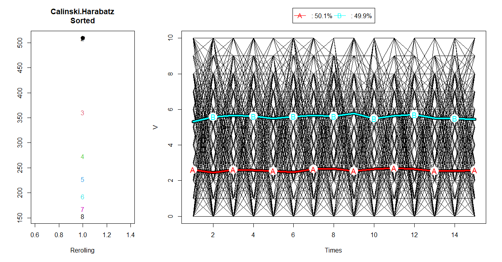 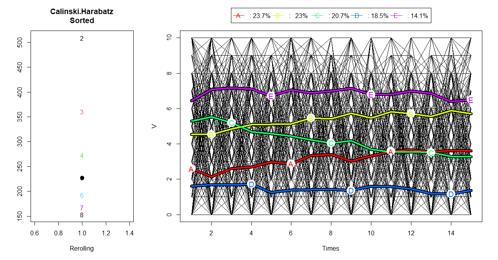
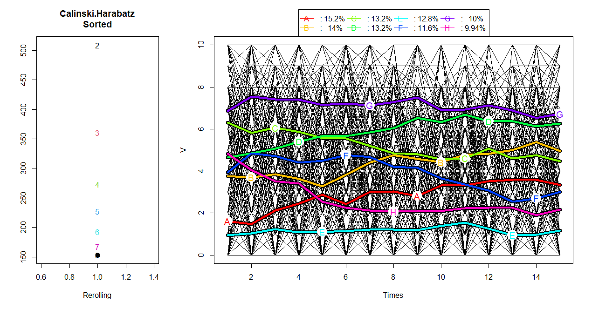

### 200416-script-cluster-variance.R

Cluster Example with 2 clusters.

```{r}
traj <- matrix(c(1,2,3,1,4, 3,6,1,8,10, 1,2,1,3,2, 4,2,5,6,3, 4,3,4,4,4, 7,6,5,5,4),6)
traj
myCld <- clusterLongData(
  traj=traj,
  idAll=as.character(c(100,102,103,109,115,123)),
  time=c(1,2,4,8,15),
  varNames="P",
  maxNA=3
)
# kml(myCld, 2, toPlot = 'both')
# x11(type = "Xlib")
# choice(myCld)
# plot(myCld)
```

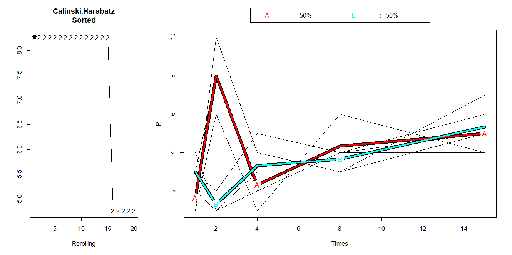

### 200416-so-cluster-variance.R

...Same as before but with better possibility to visualize clusters and
assignment of trajectories to theses classes.

```{r}
traj <- matrix(c(1,2,3,1,4, 3,6,1,8,10, 1,2,1,3,2, 4,2,5,6,3, 4,3,4,4,4, 7,6,5,5,4),6)
traj
myCld <- clusterLongData(
  traj=traj,
  idAll=as.character(c(100,102,103,109,115,123)),
  time=c(1,2,4,8,15),
  varNames="P",
  maxNA=3
)

# kml(myCld, 2)
# imsbasics::save_rdata(myCld, "myCld", save_path, force = TRUE)
myCld <- imsbasics::load_rdata("myCld", load_path)
plot(myCld, 2, parTraj=parTRAJ(col="clusters"), toPlot = "traj")
# https://stackoverflow.com/questions/61247205/how-can-we-show-the-trajectories-belonging-to-clusters-in-kml-package
```

### 200417-script-liste-thomas.R

Longitudinal Clustering of different variables. Doesn't work in many
cases, because the variables are not available for desired timespan.

-   PYYC71 2012-2014 (doesn't work) - Self-Perception: little influence
    on life event
-   PYYC75 2004-2017 (doesn't work) - Self-Perception: feeling of
    selfsatisfaction
-   PYYC106 2004-2017 (doesn't work) - Sense of control: What I want is
    in my hands
-   PYYC108 2004-2017 (doesn't work) - Sense of control: Others
    determine what I can do
-   PYYC06A 2004-2018 (works) - Health problems: Sleeping problems: Last
    4 weeks

```{r}
# sleep_problems <- import_long_cols("P_USER.sav", "data/rawdata/Data SPSS/SHP-Data-W1-W21-SPSS",
#                          cols = c("IDPERS", "PYYC06A"), year_start = "2004", year_end = "2018")
# imsbasics::save_rdata(sleep_problems, "sleep_problems", save_path, force = TRUE)
sleep_problems <- imsbasics::load_rdata("sleep_problems", load_path)
sleep_problems <- sleep_problems %>% filter(complete.cases(.))
sleep_problems <- clusterLongData(sleep_problems)
# kml(sleep_problems, 6)
# plot(sleep_problems, 6, parTraj=parTRAJ(col="clusters"),
#      toPlot = "traj", xlab = "Jahr",
#      main = "PYYC06A - Health problems: Sleeping problems: Last 4 weeks")
```

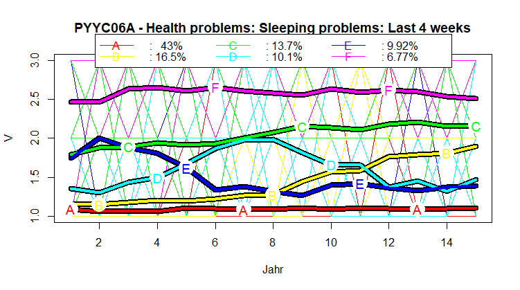

-   PYYW604 2004-2018 (works) - CMJ: Work conditions: stress

```{r}
# stress <- import_long_cols("P_USER.sav", "data/rawdata/Data SPSS/SHP-Data-W1-W21-SPSS",
#                            cols = c("IDPERS", "PYYW604"), year_start = "2004", year_end = "2018")
# imsbasics::save_rdata(stress, "stress", save_path, force = TRUE)
stress <- imsbasics::load_rdata("stress", load_path)
stress <- stress %>% filter(complete.cases(.))
stress <- clusterLongData(stress)
# kml(stress, 6)
# plot(stress, 6, parTraj=parTRAJ(col="clusters"), toPlot = "traj", xlab = "Jahr",
#      main = "PYYW604 - CMJ: Work conditions: stress")
```

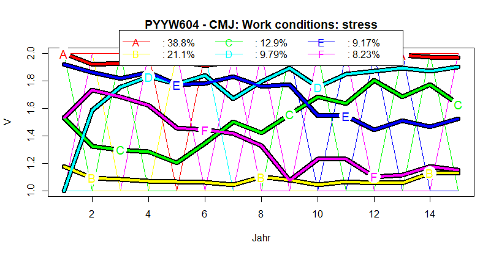

-   PYYW93 2004-2018 (works) - CMJ: Satisfaction: Work conditions

```{r}
# work_conditions <- import_long_cols("P_USER.sav", "data/rawdata/Data SPSS/SHP-Data-W1-W21-SPSS",
#                          cols = c("IDPERS", "PYYW93"), year_start = "2004", year_end = "2018")
# imsbasics::save_rdata(work_conditions, "work_conditions", save_path, force = TRUE)
work_conditions <- imsbasics::load_rdata("work_conditions", load_path)
work_conditions <- work_conditions %>% filter(complete.cases(.))
work_conditions <- clusterLongData(work_conditions)
# kml(work_conditions, 6)
# plot(work_conditions, 6, parTraj=parTRAJ(col="clusters"), toPlot = "traj", xlab = "Jahr",
#      main = "PYYW93 - CMJ: Satisfaction: Work conditions")
```

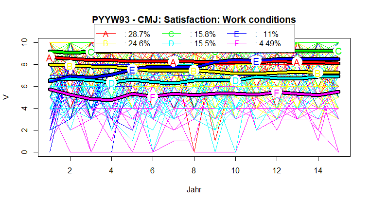

... (the following plots are not generated here since that's too
expensive)

-   PYYW94 2004-2017 (works) CMJ: Satisfaction: Work atmosphere
-   PYYW228 2004-2017 (works) CMJ: Satisfaction: Job in general
-   PYYF50 2004-2017 (works) Interference \<-\> private activities /
    family obligations
-   PYYF51 2004-2017 (works) Exhausted after work to do what you would
    like
-   PYYF52 2004-2017 (works) How difficult to deconnect from work
-   PYYC111 2004-2017 (doesn't work) Worries: Not keeping my workload up
    to date
-   PYYC115 2004-2017 (doesn't work) Worries: Leaving the work
    unfinished

### 200418-script-household-vars-thomas.R

Longitudinal Clustering of two household variables:

-   HYYH01 1999-2018 - Improvement or deterioration of standard of
    living
-   HYYF53 1999-2018 - Child care: In case of illness (ATTENTION - only
    13 complete cases!)

```{r}
# standard_of_living <- import_long_cols("H_USER.sav", "data/rawdata/Data SPSS/SHP-Data-W1-W21-SPSS",
#                                        cols = c("IDHOUS", "HYYH01"), year_start = "2000", year_end = "2018")
#
# imsbasics::save_rdata(standard_of_living, "standard_of_living", save_path, force = TRUE)
standard_of_living <- imsbasics::load_rdata("standard_of_living", load_path)
standard_of_living <- standard_of_living %>% filter(complete.cases(.))
standard_of_living <- clusterLongData(standard_of_living)
# kml(standard_of_living, c(2:6))
# plot(standard_of_living, 2, parTraj=parTRAJ(col="clusters"), toPlot = "both", xlab = "Jahr")
# plot(standard_of_living, 3, parTraj=parTRAJ(col="clusters"), toPlot = "both", xlab = "Jahr")
# plot(standard_of_living, 4, parTraj=parTRAJ(col="clusters"), toPlot = "both", xlab = "Jahr")
# plot(standard_of_living, 5, parTraj=parTRAJ(col="clusters"), toPlot = "both", xlab = "Jahr")
# plot(standard_of_living, 6, parTraj=parTRAJ(col="clusters"), toPlot = "both", xlab = "Jahr")
```

|                                       |                                       |
|---------------------------------------|---------------------------------------|
| 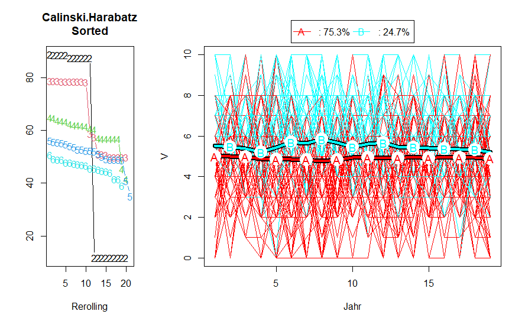 | 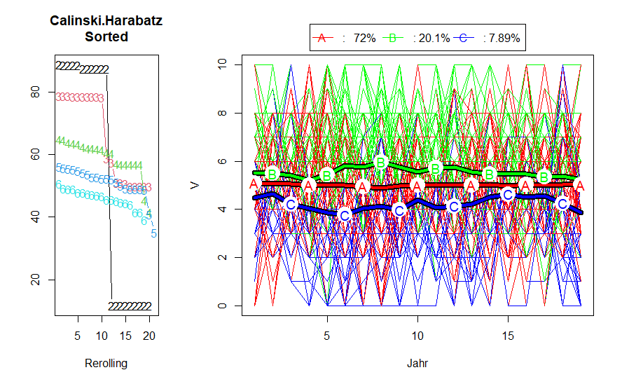 |
| 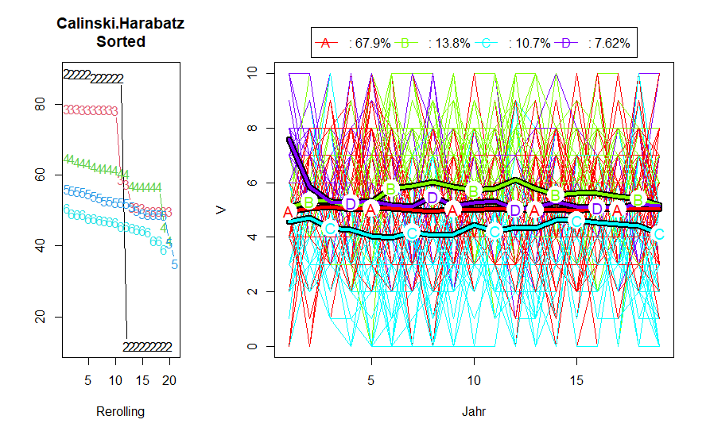 | 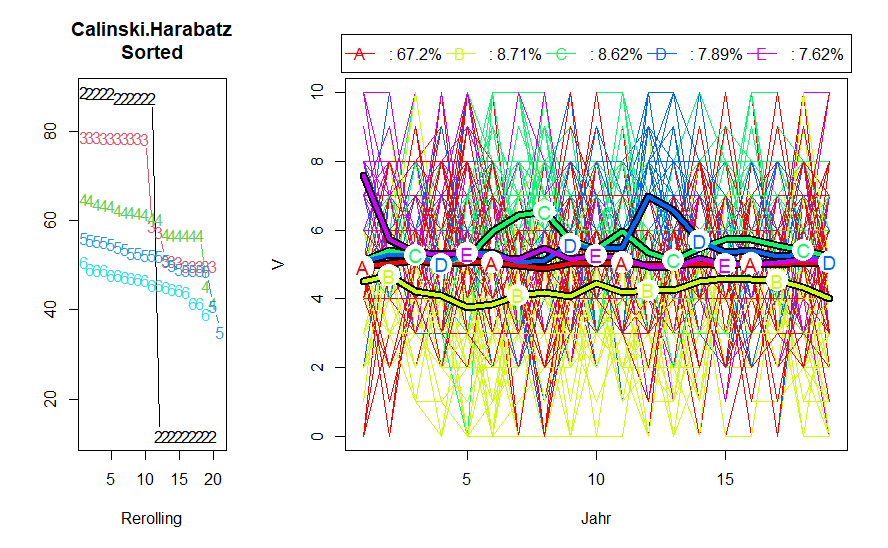 |
| 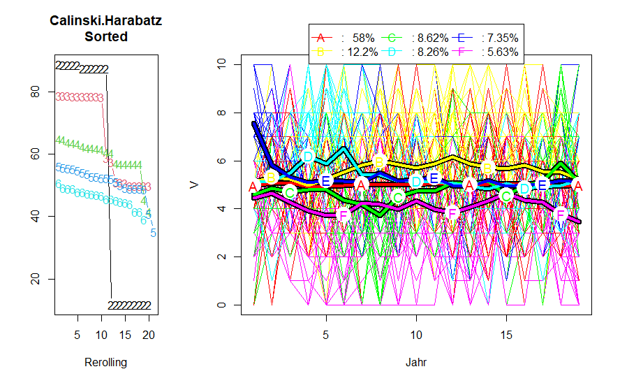 |                                       |

```{r}
# child_care <- import_long_cols("H_USER.sav", "data/rawdata/Data SPSS/SHP-Data-W1-W21-SPSS",
#                          cols = c("IDHOUS", "HYYF53"), year_start = "1999", year_end = "2018")
# imsbasics::save_rdata(child_care, "child_care", save_path, force = TRUE)
child_care <- imsbasics::load_rdata("child_care", load_path)
child_care <- child_care %>% filter(complete.cases(.))
child_care <- clusterLongData(child_care)
# kml(child_care, c(2:6))
# plot(child_care, 2, parTraj=parTRAJ(col="clusters"), toPlot = "both", xlab = "Jahr")
# plot(child_care, 3, parTraj=parTRAJ(col="clusters"), toPlot = "both", xlab = "Jahr")
# plot(child_care, 4, parTraj=parTRAJ(col="clusters"), toPlot = "both", xlab = "Jahr")
# plot(child_care, 5, parTraj=parTRAJ(col="clusters"), toPlot = "both", xlab = "Jahr")
# plot(child_care, 6, parTraj=parTRAJ(col="clusters"), toPlot = "both", xlab = "Jahr")
```

|                               |                               |
|-------------------------------|-------------------------------|
| 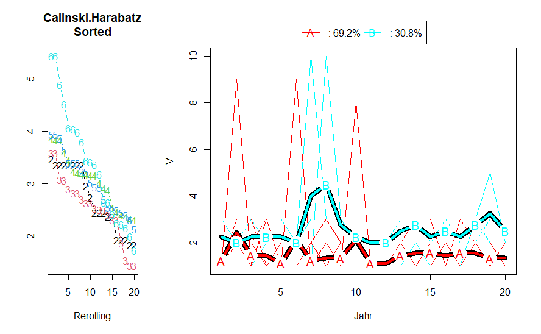 | 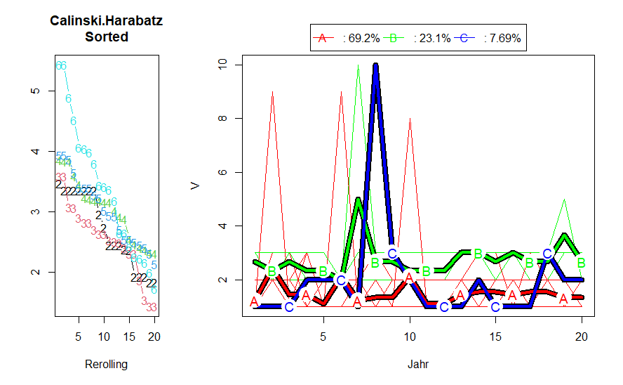 |
| 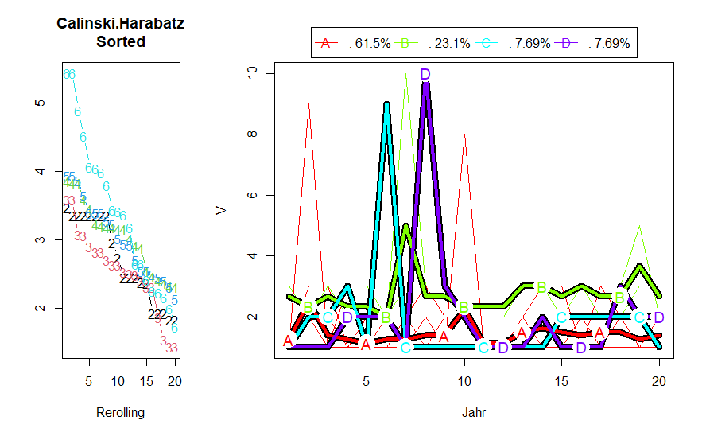 | 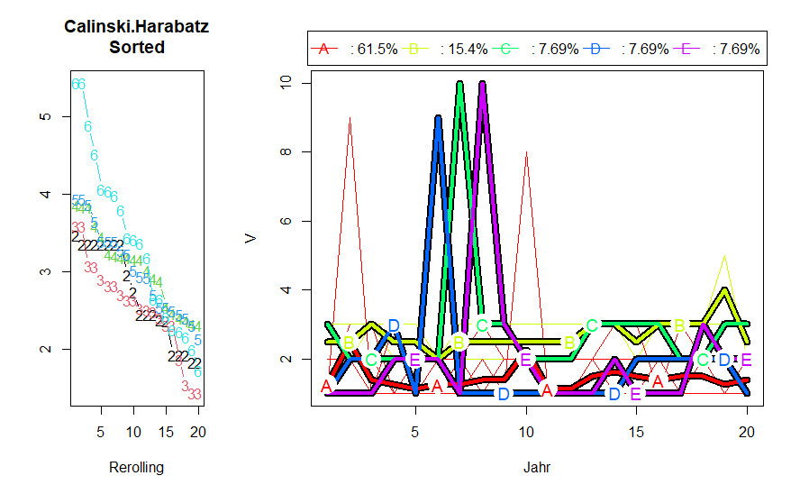 |
| 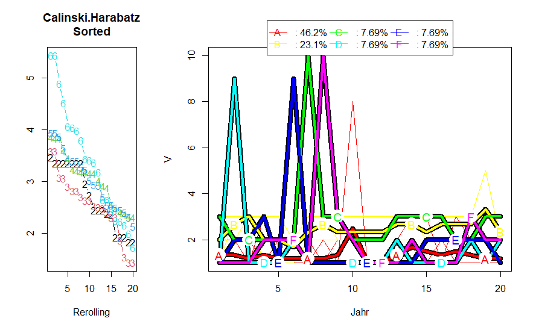 |                               |

### 200420-script-cluster-variable-change.R

Further Analysis on PYYF50 2004-2018 (**Interference** \<-\> private
activities / family obligations). We cluster by the **change** of the
variable (`Year X+1` - `Year X`)

```{r}
# interference <- import_long_cols("P_USER.sav", "data/rawdata/Data SPSS/SHP-Data-W1-W21-SPSS",
#                          cols = c("IDPERS", "PYYF50"), year_start = "2004", year_end = "2018")
# imsbasics::save_rdata(interference, "interference", save_path, force = TRUE)
interference <- imsbasics::load_rdata("interference", load_path)
interference <- interference %>% filter(complete.cases(.))

interference <- interference %>% pivot_longer(cols = -ID) %>% group_by(ID) %>% mutate(diff = lead(value) - value)
interference <- interference[, -3]
interference <- interference %>% pivot_wider(names_from = name, values_from = diff)
interference <- interference[, -ncol(interference)]
interference <- as.data.frame(interference)

interference <- clusterLongData(interference)
# kml(interference, c(2:6))

# x11(type = "Xlib"); choice(interference)
# choice(interference)
#
# plot(interference, 2, parTraj=parTRAJ(col="clusters"), toPlot = "both", xlab = "Jahr")
# plot(interference, 3, parTraj=parTRAJ(col="clusters"), toPlot = "both", xlab = "Jahr")
# plot(interference, 4, parTraj=parTRAJ(col="clusters"), toPlot = "both", xlab = "Jahr")
# plot(interference, 5, parTraj=parTRAJ(col="clusters"), toPlot = "both", xlab = "Jahr")
# plot(interference, 6, parTraj=parTRAJ(col="clusters"), toPlot = "both", xlab = "Jahr")
```

|                                 |                                 |
|---------------------------------|---------------------------------|
| 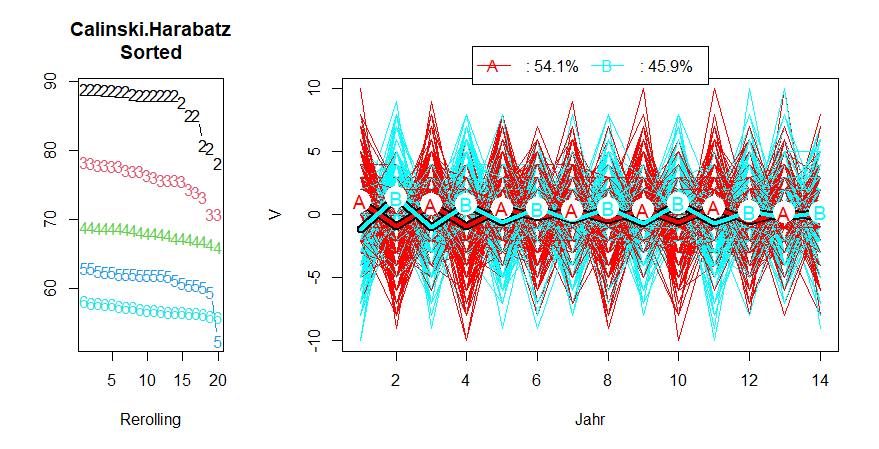 | 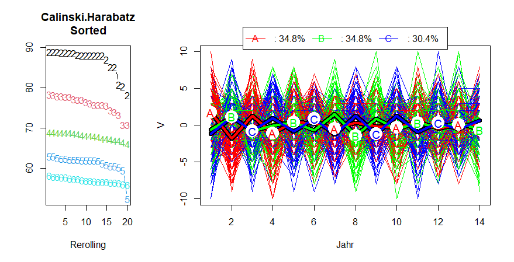 |
| 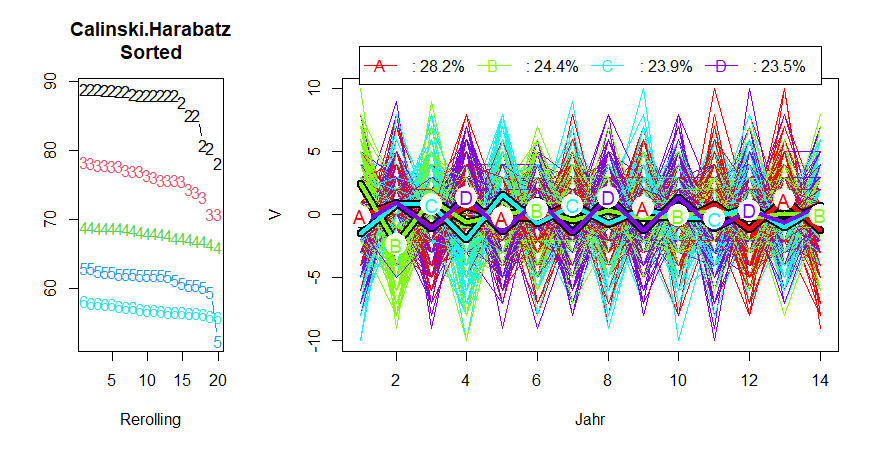 | 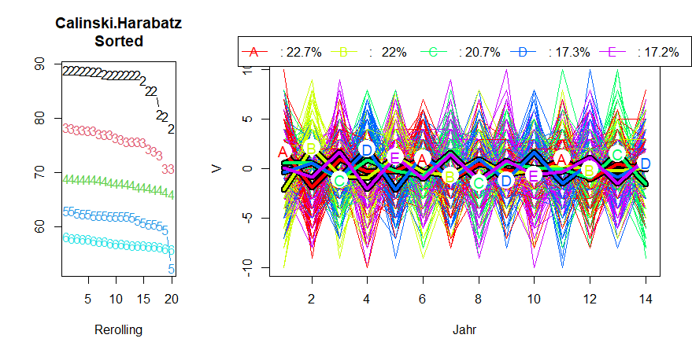 |
| 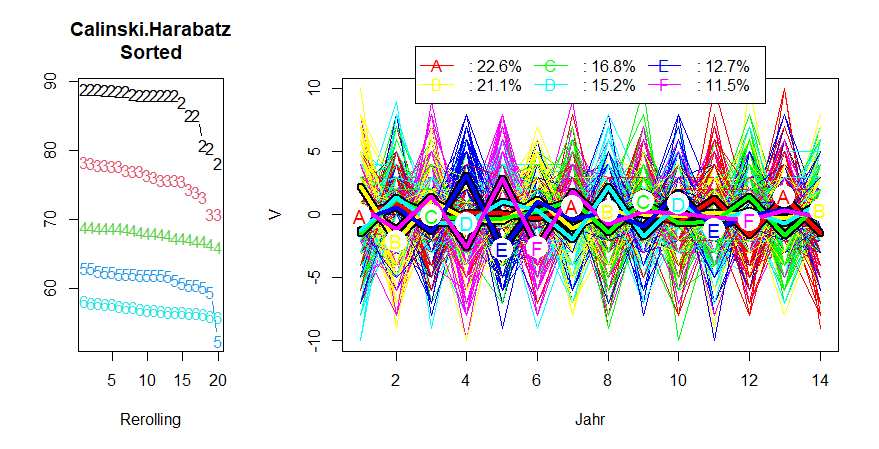 |                                 |

```{r}
# plotAllCriterion(interference, criterion=CRITERION_NAMES[1:5])
# interference@criterionActif <- "Ray.Turi"
# choice(interference)
# plot(interference,3,parMean=parMEAN(type="l"))
```

|                                 |                                 |
|---------------------------------|---------------------------------|
| 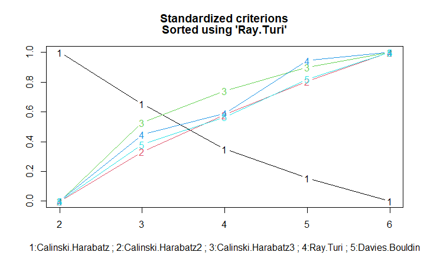 | 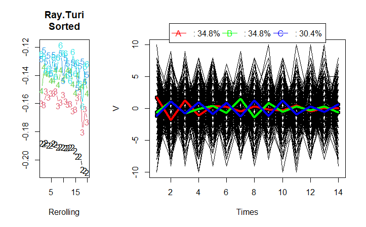 |


Further Analysis on HYYH01 2004-2018 (Improvement or deterioration of **standard of living**).
We cluster by the **change** of the variable (`Year X+1` - `Year X`)

```{r}
# standard_of_living <- import_long_cols("H_USER.sav", "data/rawdata/Data SPSS/SHP-Data-W1-W21-SPSS",
#                                        cols = c("IDHOUS", "HYYH01"), year_start = "2004", year_end = "2018")
# imsbasics::save_rdata(standard_of_living, "standard_of_living_2004-2018", save_path, force = TRUE)
standard_of_living <- imsbasics::load_rdata("standard_of_living_2004-2018", load_path)


standard_of_living <- standard_of_living %>% filter(complete.cases(.))

standard_of_living <- standard_of_living %>% pivot_longer(cols = -ID) %>% group_by(ID) %>% mutate(diff = lead(value) - value)
standard_of_living <- standard_of_living[, -3]
standard_of_living <- standard_of_living %>% pivot_wider(names_from = name, values_from = diff)
standard_of_living <- standard_of_living[, -ncol(standard_of_living)]
standard_of_living <- as.data.frame(standard_of_living)

standard_of_living <- clusterLongData(standard_of_living)
# kml(standard_of_living, c(2:6))
#
# choice(standard_of_living)
# plot(standard_of_living, 2, parTraj=parTRAJ(col="clusters"), toPlot = "both", xlab = "Jahr")
# plot(standard_of_living, 3, parTraj=parTRAJ(col="clusters"), toPlot = "both", xlab = "Jahr")
# plot(standard_of_living, 4, parTraj=parTRAJ(col="clusters"), toPlot = "both", xlab = "Jahr")
# plot(standard_of_living, 5, parTraj=parTRAJ(col="clusters"), toPlot = "both", xlab = "Jahr")
# plot(standard_of_living, 6, parTraj=parTRAJ(col="clusters"), toPlot = "both", xlab = "Jahr")
```

|                                            |                                            |
|--------------------------------------------|--------------------------------------------|
| 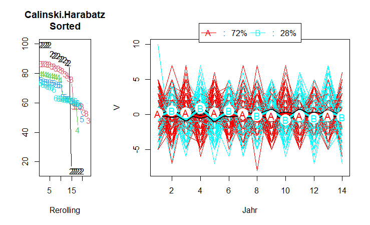 | 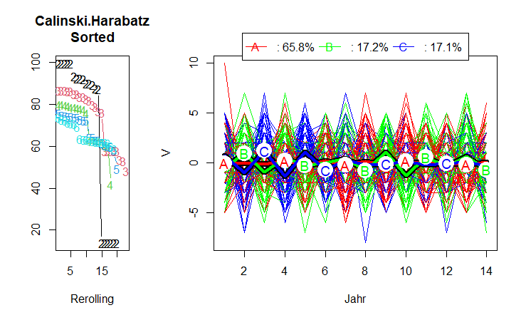 |
| 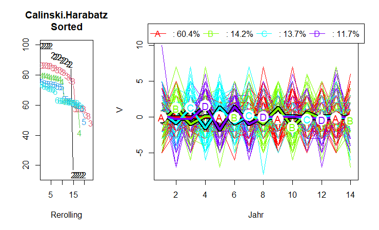 | 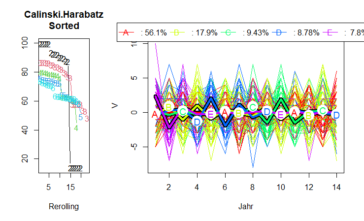 |
| 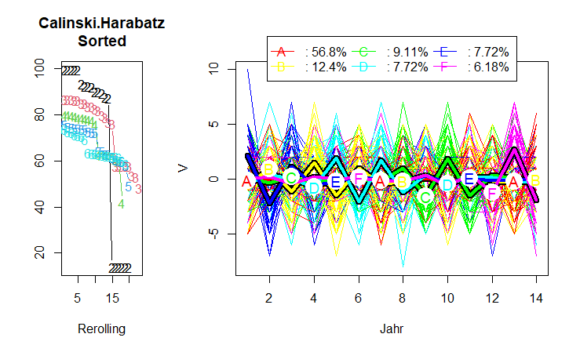 |                                            |


### 200420-script-explain-sleeping-problems

We look at the sleeping problems per individual (2004 - 2018). We add the cluster
(A or B - we look at only two clusters)

```{r}
# sleep_problems <- import_long_cols("P_USER.sav", "data/rawdata/Data SPSS/SHP-Data-W1-W21-SPSS",
#                          cols = c("IDPERS", "PYYC06A"), year_start = "2004", year_end = "2018")
# imsbasics::save_rdata(sleep_problems, "sleep_problems", save_path, force = TRUE)
data <- imsbasics::load_rdata("sleep_problems", load_path)
data <- data %>% filter(complete.cases(.))

# PYYC06A <- clusterLongData(data)
# kml(PYYC06A, c(2:6))
# imsbasics::save_rdata(PYYC06A, "PYYC06A", save_path, force = TRUE)
PYYC06A <- imsbasics::load_rdata("PYYC06A", load_path)
plot(PYYC06A, 2, parTraj=parTRAJ(col="clusters"), toPlot = "both", xlab = "Jahr")
# plot(PYYC06A, 3, parTraj=parTRAJ(col="clusters"), toPlot = "both", xlab = "Jahr")
# plot(PYYC06A, 4, parTraj=parTRAJ(col="clusters"), toPlot = "both", xlab = "Jahr")
# plot(PYYC06A, 5, parTraj=parTRAJ(col="clusters"), toPlot = "both", xlab = "Jahr")
# plot(PYYC06A, 6, parTraj=parTRAJ(col="clusters"), toPlot = "both", xlab = "Jahr")
# choice(PYYC06A)
```


We add the age & gender per Individual (In year 2010).
```{r}
data$cluster <- as.character(PYYC06A@c2[[1]]@clusters)
age <- import_cols("SHP10_P_USER.sav", "data/rawdata/Data SPSS/SHP-Data-W1-W21-SPSS/W12_2010",
                   cols = c("IDPERS", "AGE10"))
names(age)[1] <- "ID"
data <- left_join(data, age)

gender <- import_cols("SHP10_P_USER.sav", "data/rawdata/Data SPSS/SHP-Data-W1-W21-SPSS/W12_2010",
                      cols = c("IDPERS", "SEX10"))
names(gender)[1] <- "ID"
data <- left_join(data, gender)

ggplot(data = data, aes(x = AGE10, y = SEX10, color = cluster)) + geom_point()
```


Then we balance the dataset:

 * 1'717 objects are in Cluster A
 * 692 objects are in cluster B

We take create a balanced dataset with 692 samples of Cluster A (sampled from all 1'717)
and all 692 objects of Cluster B.

We see that Cluster A has 45% of Gender 1 and 55% of Gender 2.
We see that Cluster B has 29% of Gender 1 and 71% of Gender 2.

```{r}
data_balanced <- data[, 17:19]
data_balanced_true <- data_balanced[data_balanced$cluster == "B", ]
data_balanced_false <- data_balanced[!data_balanced$cluster == "B", ]
set.seed(123)
sample <- sample(1:nrow(data_balanced_false), nrow(data_balanced_true))
stopifnot(length(sample) == length(unique(sample)))
data_balanced <- rbind(data_balanced_true, data_balanced_false[sample, ])

data_balanced$cluster <- as.factor(data_balanced$cluster)
data_balanced$SEX10 <- as.factor(data_balanced$SEX10)

table(data_balanced[, -2])/nrow(data_balanced_true)*100

par(mfrow = c(1,2))
hist(data_balanced$AGE10[data_balanced$cluster == "A"])
hist(data_balanced$AGE10[data_balanced$cluster == "B"])

# data_balanced$mean_age_by_cluster <- data_balanced
# data_balanced <- data_balanced %>% group_by(cluster) %>% mutate(mean_age_by_cluster = mean(AGE10))
# data_balanced <- data_balanced %>% group_by(SEX10) %>% mutate(mean_age_by_sex = mean(AGE10))


# Michi
print("mean age by cluster")
cat("Cluster A:", mean(data_balanced$AGE10[data_balanced$cluster == "A"]))
cat("Cluster B:", mean(data_balanced$AGE10[data_balanced$cluster == "B"]))


print("mean age by sex")
cat("Sex 1:", mean(data_balanced$AGE10[data_balanced$SEX10 == 1]))
cat("Sex 2:", mean(data_balanced$AGE10[data_balanced$SEX10 == 2]))
```


### 200901-script-schritt1-clustering.R
-> see 200901-script-schritt1-clustering_v2.R


### 200901-script-schritt1-clustering_v2.R {.tabset}

We investigate the following 3 variables between 2008 and 2018:

 * `OCCUPAYY`: Actual occupation, from grid
 * `AGEYY`: Age in year of interview
 * `PYYC17`: Depression, blues, anxiety: Frequency

The analysis is narrowed down to groups with `OCCUPAYY` $\in \{1,2,3,4\}$ and
`AGEYY` $\in \{15,...,65\}$.
Explanation for `OCCUPAYY`:

 * 1 "Bezahlte Erwerbstätigkeit, vollzeit (reguläre Arbeitszeit 37 Stunden pro Woche oder mehr)"
 * 2 "Bezahlte Erwerbstätigkeit, teilzeit (reguläre Arbeitszeit 5-36 Stunden pro Woche)"
 * 3 "Bezahlte Erwerbstätigkeit, teilzeit (1 - 4 Stunden / Woche)"
 * 4 "In Ausbildung (Lehrling, Schüler/In, Student/In)"
 * 5 "Mitarbeit im Familienbetrieb"
 * 6 "Arbeit in geschützter Werkstatt (für Behinderte, Personen mit Problemen)"
 * 7 "Kind/Frau/Mann im Haushalt (nur bis maximal 64 bzw. 65 Jahre)"
 * 8 "Rentner (AHV)"
 * 9 "Rentner, (IV usw.)"
 * 10 "Arbeitslos"
 * 11 "Andere Tätigkeit (Weiterbildung, unbezahlter Urlaub)"


#### data preparation

```{r}
# data <- import_long_cols("P_USER.sav", "data/rawdata/Data SPSS/SHP-Data-W1-W21-SPSS",
#                          cols = c("IDPERS", "OCCUPAYY", "AGEYY", "PYYC17"),
#                          year_start = "2008", year_end = "2018")
# longer <- data
#
# imsbasics::save_rdata(longer, "longer_script_200901", save_path, force = TRUE)
longer <- imsbasics::load_rdata("longer_script_200901", load_path)

longer <- longer %>%
  pivot_longer(-ID,
               names_to = c('.value', 'year'),
               names_pattern = '([A-Z]+)(\\d+)')

occupied_and_right_age <- longer %>%
  group_by(ID) %>%
  filter(all(OCCUPA %in% c(1:4))) %>%
  filter(all(AGE %in% c(15:65))) %>%
  rename(depression = P)

head(occupied_and_right_age, n = 20)
```

#### Distribution of Age & Depression

Distribution of "Mean-Age" / "all depression values" / "mean depression per person"

```{r}
df <- occupied_and_right_age
ggplot(df %>% group_by(ID) %>% summarise(AGE = mean(AGE))) +
  geom_histogram(aes(x = AGE), binwidth =  5)

ggplot(df) +
  geom_histogram(aes(x = depression), bins = 11)

ggplot(df %>% group_by(ID) %>% summarise(depression = mean(depression))) +
  geom_histogram(aes(x = depression))
```

#### Mean depression over time
Mean depression of all subjects between 2008 and 2018
```{r}
dep_per_year <- df %>%
  mutate(year = as.numeric(paste0("20", year))) %>%
  group_by(year) %>%
  summarise(depression = mean(depression, na.rm = TRUE))
ggplot(dep_per_year, aes(x = as.integer(year), y = depression)) +
  geom_line() +
  geom_smooth(method = "lm") +
  scale_x_continuous(breaks = c(2008, 2010, 2015, 2017), minor_breaks = c(2008:2017)) +
  scale_y_continuous(breaks = c(0:10), limits = c(0,3))
```

#### clustering {.tabset}

##### kml-clustering

We look at every individuals depression level between 2008 and 2018 (NA's are filled
using `zoo::na.locf()`) and cluster them with 2-8 clusters...

 * For 2 Clusters (`cluster_2` -> A, B) we cluster group B (high depression-levels)
 into 3 more subclusters (`cluster_second_level` -> A,B,C). = Total 4 Clusters.
 * For 5 Clusters (`cluster_5` -> A,B,C,D,E) we take A&B together (B becomes also A) = Total 4 clusters.

```{r}
depression_per_id_wide <- occupied_and_right_age %>%
  select(-OCCUPA, -AGE) %>%
  pivot_wider(names_from = year, values_from = depression)
depression_per_id_wide_no_na <- zoo::na.locf(depression_per_id_wide)
occupied_and_right_age_clustered <- clusterLongData(as.data.frame(depression_per_id_wide_no_na))
# kml(occupied_and_right_age_clustered, c(2:8), 1)
# x11(type = "Xlib"); choice(occupied_and_right_age_clustered)
# imsbasics::save_rdata(occupied_and_right_age_clustered, "occupied_and_right_age_clustered_200901", save_path, force = TRUE)
occupied_and_right_age_clustered <- imsbasics::load_rdata("occupied_and_right_age_clustered_200901", load_path)
# x11(type = "Xlib"); choice(occupied_and_right_age_clustered)
plot(occupied_and_right_age_clustered, 2, parTraj=parTRAJ(col="clusters"), toPlot = "both", xlab = "Jahr")
plot(occupied_and_right_age_clustered, 5, parTraj=parTRAJ(col="clusters"), toPlot = "both", xlab = "Jahr")

## Add Clusters (A,B,C, ...) to dataset
depression_per_id_wide_no_na$cluster_2 <- as.character(occupied_and_right_age_clustered@c2[[1]]@clusters)
depression_per_id_wide_no_na$cluster_3 <- as.character(occupied_and_right_age_clustered@c3[[1]]@clusters)
depression_per_id_wide_no_na$cluster_4 <- as.character(occupied_and_right_age_clustered@c4[[1]]@clusters)
depression_per_id_wide_no_na$cluster_5 <- as.character(occupied_and_right_age_clustered@c5[[1]]@clusters)
depression_per_id_wide_no_na$cluster_6 <- as.character(occupied_and_right_age_clustered@c6[[1]]@clusters)
depression_per_id_wide_no_na$cluster_7 <- as.character(occupied_and_right_age_clustered@c7[[1]]@clusters)
depression_per_id_wide_no_na$cluster_8 <- as.character(occupied_and_right_age_clustered@c8[[1]]@clusters)
## interessante Cluster: 2A, 3C, 5C, 5D, 6E, 7C, 7D, 7F, 8..?

## clustering 2..
# second_clustering <- depression_per_id_wide_no_na %>%
#   filter(cluster_2 == "B") %>%
#   select(-starts_with("cluster_"))
# second_clustering <- clusterLongData(as.data.frame(second_clustering))
# kml(second_clustering, c(2:8), 1)
# imsbasics::save_rdata(second_clustering, "second_clustering_200901", save_path, force = TRUE)
second_clustering <- imsbasics::load_rdata("second_clustering_200901", load_path)

# x11(type = "Xlib"); choice(second_clustering)
hierarchie2 <- data.frame(
  ID = as.numeric(second_clustering@idAll),
  cluster_second_level = as.character(second_clustering@c3[[1]]@clusters)
)
depression_per_id_wide_no_na <- left_join(
  depression_per_id_wide_no_na,
  hierarchie2,
  by = "ID")
depression_per_id_wide_no_na <- depression_per_id_wide_no_na %>%
  mutate(cluster_second_level = replace_na(cluster_second_level, "O"))

glimpse(depression_per_id_wide_no_na)
```

##### Evaluation on 4 (1+3) Clusters (low=0 / high=A,B,C)

The 4 sub-clusters show obvious tendencies (see plots)

 * `dep_clustering`: Depression for <person, year> plus Sub-cluster (A,B,C,O)
 * `dep_clustering_median`: Meadian Depression-level per Sub-cluster (A,B,C,O) per year
 * `dep_clus_summary`: Percentage of assignment to sub-cluster (A = 14%, B=7%, C=5%, O=75%)

```{r}
dep_clustering <- depression_per_id_wide_no_na %>%
  select(-matches("cluster_\\d$")) %>%
  pivot_longer(-c(ID, cluster_second_level), names_to = "year", values_to = "depression") %>%
  mutate(year = as.numeric(paste0("20", year))) %>%
  ungroup()

dep_clustering_median <- dep_clustering %>%
  group_by(cluster_second_level, year) %>%
  summarise(depression = median(depression))

dep_clus_summary <- dep_clustering %>%
  group_by(cluster_second_level) %>%
  rename(cluster = cluster_second_level) %>%
  summarise(percentage = round(n()/nrow(.)*100))

# Plot the means
ggplot(dep_clustering_median, aes(x = year, y = depression, color = cluster_second_level)) +
  geom_smooth(se = FALSE, method = "lm") +
  scale_x_continuous(breaks = c(2008, 2010, 2015, 2017), minor_breaks = c(2008:2017)) +
  scale_color_discrete(name = "cluster", labels = paste0(dep_clus_summary$cluster,": ", dep_clus_summary$percentage, "%"))
# Plot means + cluster-A-trajectories
ggplot(dep_clustering_median, aes(x = year, y = depression, color = cluster_second_level)) +
  geom_smooth(se = FALSE, method = "lm") +
  scale_x_continuous(breaks = c(2008, 2010, 2015, 2017), minor_breaks = c(2008:2017)) +
  scale_color_discrete(name = "cluster", labels = paste0(dep_clus_summary$cluster,": ", dep_clus_summary$percentage, "%")) +
  geom_line(data = dep_clustering %>% filter(cluster_second_level == "A"), aes(group = ID), alpha = 0.05)
# Plot means + cluster-B-trajectories
ggplot(dep_clustering_median, aes(x = year, y = depression, color = cluster_second_level)) +
  geom_smooth(se = FALSE, method = "lm") +
  scale_x_continuous(breaks = c(2008, 2010, 2015, 2017), minor_breaks = c(2008:2017)) +
  scale_color_discrete(name = "cluster", labels = paste0(dep_clus_summary$cluster,": ", dep_clus_summary$percentage, "%")) +
  geom_line(data = dep_clustering %>% filter(cluster_second_level == "B"), aes(group = ID), alpha = 0.05)
# Plot means + cluster-C-trajectories
ggplot(dep_clustering_median, aes(x = year, y = depression, color = cluster_second_level)) +
  geom_smooth(se = FALSE, method = "lm") +
  scale_x_continuous(breaks = c(2008, 2010, 2015, 2017), minor_breaks = c(2008:2017)) +
  scale_color_discrete(name = "cluster", labels = paste0(dep_clus_summary$cluster,": ", dep_clus_summary$percentage, "%")) +
  geom_line(data = dep_clustering %>% filter(cluster_second_level == "C"), aes(group = ID), alpha = 0.05)
# Plot means + cluster-O-trajectories
ggplot(dep_clustering_median, aes(x = year, y = depression, color = cluster_second_level)) +
  geom_smooth(se = FALSE, method = "lm") +
  scale_x_continuous(breaks = c(2008, 2010, 2015, 2017), minor_breaks = c(2008:2017)) +
  scale_color_discrete(name = "cluster", labels = paste0(dep_clus_summary$cluster,": ", dep_clus_summary$percentage, "%")) +
  geom_line(data = dep_clustering %>% filter(cluster_second_level == "O"), aes(group = ID), alpha = 0.02)


dep_clustering_min_median_max <- dep_clustering %>%
  group_by(cluster_second_level, year) %>%
  summarise(ymin = quantile(depression, .01),
            ymedian = median(depression),
            ymax = quantile(depression, .99))

ggplot(dep_clustering_min_median_max, aes(x = year, y = ymedian, color = cluster_second_level)) +
  geom_ribbon(aes(ymin = ymin, ymax = ymax, fill = cluster_second_level), alpha = 0.2) +
  geom_smooth(aes(fill = cluster_second_level), method = lm, se = FALSE) +
  scale_x_continuous(breaks = c(2008, 2010, 2015, 2017), minor_breaks = c(2008:2017)) +
  scale_color_discrete(name = "cluster", labels = paste0(dep_clus_summary$cluster,": ", dep_clus_summary$percentage, "%")) +
  guides(fill = FALSE)
```

##### Evaluation on 4 Clusters (A=A+B, C,D,E)

The 4 sub-clusters show obvious tendencies (see plots)

 * `dep_clustering`: Depression for <person, year> plus Sub-cluster (A,C,D,E)
 * `dep_clustering_median`: Meadian Depression-level per Sub-cluster (A,C,D,E) per year
 * `dep_clus_summary`: Percentage of assignment to sub-cluster (A = 74%, C=14%, D=5%, E=5%)

```{r}
dep_clustering <- depression_per_id_wide_no_na %>%
  mutate(cluster_second_level = cluster_5) %>%
  mutate(cluster_second_level = ifelse(cluster_second_level == "B", "A", cluster_second_level)) %>%
  select(-matches("cluster_\\d$")) %>%
  pivot_longer(-c(ID, cluster_second_level), names_to = "year", values_to = "depression") %>%
  mutate(year = as.numeric(paste0("20", year))) %>%
  ungroup()

dep_clustering_median <- dep_clustering %>%
  group_by(cluster_second_level, year) %>%
  summarise(depression = median(depression))

dep_clus_summary <- dep_clustering %>%
  group_by(cluster_second_level) %>%
  rename(cluster = cluster_second_level) %>%
  summarise(percentage = round(n()/nrow(.)*100))

ggplot(dep_clustering_median, aes(x = year, y = depression, color = cluster_second_level)) +
  geom_smooth(se = FALSE, method = "lm") +
  scale_x_continuous(breaks = c(2008, 2010, 2015, 2017), minor_breaks = c(2008:2017)) +
  scale_color_discrete(name = "cluster", labels = paste0(dep_clus_summary$cluster,": ", dep_clus_summary$percentage, "%"))

# ggplot(dep_clustering_median, aes(x = year, y = depression, color = cluster_second_level)) +
#   geom_smooth(se = FALSE, method = "lm") +
#   scale_x_continuous(breaks = c(2008, 2010, 2015, 2017), minor_breaks = c(2008:2017)) +
#   scale_color_discrete(name = "cluster", labels = paste0(dep_clus_summary$cluster,": ", dep_clus_summary$percentage, "%")) +
#   geom_line(data = dep_clustering, aes(group = ID), alpha = 0.02)

ggplot(dep_clustering_median, aes(x = year, y = depression, color = cluster_second_level)) +
  geom_smooth(se = FALSE, method = "lm") +
  scale_x_continuous(breaks = c(2008, 2010, 2015, 2017), minor_breaks = c(2008:2017)) +
  scale_color_discrete(name = "cluster", labels = paste0(dep_clus_summary$cluster,": ", dep_clus_summary$percentage, "%")) +
  geom_line(data = dep_clustering %>% filter(cluster_second_level == "A"), aes(group = ID), alpha = 0.05)

ggplot(dep_clustering_median, aes(x = year, y = depression, color = cluster_second_level)) +
  geom_smooth(se = FALSE, method = "lm") +
  scale_x_continuous(breaks = c(2008, 2010, 2015, 2017), minor_breaks = c(2008:2017)) +
  scale_color_discrete(name = "cluster", labels = paste0(dep_clus_summary$cluster,": ", dep_clus_summary$percentage, "%")) +
  geom_line(data = dep_clustering %>% filter(cluster_second_level == "C"), aes(group = ID), alpha = 0.05)

ggplot(dep_clustering_median, aes(x = year, y = depression, color = cluster_second_level)) +
  geom_smooth(se = FALSE, method = "lm") +
  scale_x_continuous(breaks = c(2008, 2010, 2015, 2017), minor_breaks = c(2008:2017)) +
  scale_color_discrete(name = "cluster", labels = paste0(dep_clus_summary$cluster,": ", dep_clus_summary$percentage, "%")) +
  geom_line(data = dep_clustering %>% filter(cluster_second_level == "D"), aes(group = ID), alpha = 0.05)

ggplot(dep_clustering_median, aes(x = year, y = depression, color = cluster_second_level)) +
  geom_smooth(se = FALSE, method = "lm") +
  scale_x_continuous(breaks = c(2008, 2010, 2015, 2017), minor_breaks = c(2008:2017)) +
  scale_color_discrete(name = "cluster", labels = paste0(dep_clus_summary$cluster,": ", dep_clus_summary$percentage, "%")) +
  geom_line(data = dep_clustering %>% filter(cluster_second_level == "E"), aes(group = ID), alpha = 0.02)

dep_clustering_min_median_max <- dep_clustering %>%
  group_by(cluster_second_level, year) %>%
  summarise(ymin = quantile(depression, .25),
            ymedian = median(depression),
            ymax = quantile(depression, .75))

ggplot(dep_clustering_min_median_max, aes(x = year, y = ymedian, color = cluster_second_level)) +
  geom_ribbon(aes(ymin = ymin, ymax = ymax, fill = cluster_second_level), alpha = 0.2) +
  geom_smooth(aes(fill = cluster_second_level), method = lm, se = FALSE) +
  scale_x_continuous(breaks = c(2008, 2010, 2015, 2017), minor_breaks = c(2008:2017)) +
  scale_y_continuous(limits = c(0,10), name = "depression level") +
  scale_color_discrete(name = "cluster", labels = paste0(dep_clus_summary$cluster,": ", dep_clus_summary$percentage, "%")) +
  guides(fill = FALSE)
```


### 200903-script-schritt1-clustering-v2-with-event.R

Analogue to `200901-script-schritt1-clustering_v2.R` - no obvious difference was
detected... Ask Adrian, if needed.


### 200908-script-schritt1-clustering-wstat.R {.tabset}

The same Analysis as in `200901-script-schritt1-clustering_v2.R` (above), but
with `WSTATYY` instead of `OCCUPAYY` to measure the working situation of individuals.

We investigate the following 3 variables between 2008 and 2018:

 * `WSTATYY`: Working Status
 * `AGEYY`: Age in year of interview
 * `PYYC17`: Depression, blues, anxiety: Frequency

The analysis is narrowed down to groups with `WSTATYY` $\in \{1\}$ and
`AGEYY` $\in \{18,...,65\}$.
Explanation for `WSTATYY`:

 * 1 "berufstaetig"
 * 2 "arbeitslos"
 * 3 "nicht im Arbeitsmarkt drin"


#### data preparation

```{r}
# data <- import_long_cols("P_USER.sav", "data/rawdata/Data SPSS/SHP-Data-W1-W21-SPSS",
#                          cols = c("IDPERS", "WSTATYY", "AGEYY", "PYYC17"),
#                          year_start = "2008", year_end = "2018")
# longer <- data
#
# imsbasics::save_rdata(longer, "longer_script_200908", save_path, force = TRUE)
longer <- imsbasics::load_rdata("longer_script_200908", load_path)

longer <- longer %>%
  pivot_longer(-ID,
               names_to = c('.value', 'year'),
               names_pattern = '([A-Z]+)(\\d+)')

occupied_and_right_age <- longer %>%
  group_by(ID) %>%
  filter(all(WSTAT %in% c(1))) %>%
  filter(all(AGE %in% c(18:65))) %>%
  rename(depression = P)

head(occupied_and_right_age, n = 20)
```

#### Distribution of Age & Depression

Distribution of "Mean-Age" / "all depression values" / "mean depression per person"

```{r}
# some exploratory plots
df <- occupied_and_right_age
ggplot(df %>% group_by(ID) %>% summarise(AGE = mean(AGE))) +
  geom_histogram(aes(x = AGE), binwidth =  5)

ggplot(df) +
  geom_histogram(aes(x = depression), bins = 11)

ggplot(df %>% group_by(ID) %>% summarise(depression = mean(depression))) +
  geom_histogram(aes(x = depression))
```

#### Mean depression over time
Mean depression of all subjects between 2008 and 2018
```{r}
dep_per_year <- df %>%
  mutate(year = as.numeric(paste0("20", year))) %>%
  group_by(year) %>%
  summarise(depression = mean(depression, na.rm = TRUE))
ggplot(dep_per_year, aes(x = as.integer(year), y = depression)) +
  geom_line() +
  geom_smooth(method = "lm") +
  scale_x_continuous(breaks = c(2008, 2010, 2015, 2017), minor_breaks = c(2008:2017)) +
  scale_y_continuous(breaks = c(0:10), limits = c(0,3))
```

#### clustering {.tabset}

##### kml-clustering

We look at every individuals depression level between 2008 and 2018 (NA's are filled
using `zoo::na.locf()`) and cluster them with 2-8 clusters...

 * For 2 Clusters (`cluster_2` -> A, B) we cluster group B (high depression-levels)
 into 3 more subclusters (`cluster_second_level` -> A,B,C). = Total 4 Clusters.
 * For 5 Clusters (`cluster_5` -> A,B,C,D,E) we take A&B together (B becomes also A) = Total 4 clusters.

```{r}
depression_per_id_wide <- occupied_and_right_age %>%
  select(-WSTAT, -AGE) %>%
  pivot_wider(names_from = year, values_from = depression)
depression_per_id_wide_no_na <- zoo::na.locf(depression_per_id_wide)
occupied_and_right_age_clustered <- clusterLongData(as.data.frame(depression_per_id_wide_no_na))
# kml(occupied_and_right_age_clustered, c(2:8), 1)
# x11(type = "Xlib"); choice(occupied_and_right_age_clustered)
# imsbasics::save_rdata(occupied_and_right_age_clustered, "occupied_and_right_age_clustered_200908", save_path, force = TRUE)
occupied_and_right_age_clustered <- imsbasics::load_rdata("occupied_and_right_age_clustered_200908", load_path)
# x11(type = "Xlib"); choice(occupied_and_right_age_clustered)
plot(occupied_and_right_age_clustered, 2, parTraj=parTRAJ(col="clusters"), toPlot = "both", xlab = "Jahr")
plot(occupied_and_right_age_clustered, 5, parTraj=parTRAJ(col="clusters"), toPlot = "both", xlab = "Jahr")

## Add Clusters (A,B,C, ...) to dataset
depression_per_id_wide_no_na$cluster_2 <- as.character(occupied_and_right_age_clustered@c2[[1]]@clusters)
depression_per_id_wide_no_na$cluster_3 <- as.character(occupied_and_right_age_clustered@c3[[1]]@clusters)
depression_per_id_wide_no_na$cluster_4 <- as.character(occupied_and_right_age_clustered@c4[[1]]@clusters)
depression_per_id_wide_no_na$cluster_5 <- as.character(occupied_and_right_age_clustered@c5[[1]]@clusters)
depression_per_id_wide_no_na$cluster_6 <- as.character(occupied_and_right_age_clustered@c6[[1]]@clusters)
depression_per_id_wide_no_na$cluster_7 <- as.character(occupied_and_right_age_clustered@c7[[1]]@clusters)
depression_per_id_wide_no_na$cluster_8 <- as.character(occupied_and_right_age_clustered@c8[[1]]@clusters)
## interessante Cluster: 2A, 3C, 5C, 5D, 6E, 7C, 7D, 7F, 8..?

## clustering 2..
second_clustering <- depression_per_id_wide_no_na %>%
  filter(cluster_2 == "B") %>%
  select(-starts_with("cluster_"))
second_clustering <- clusterLongData(as.data.frame(second_clustering))
# kml(second_clustering, c(2:8), 1)
# imsbasics::save_rdata(second_clustering, "second_clustering_200908", save_path, force = TRUE)
second_clustering <- imsbasics::load_rdata("second_clustering_200908", load_path)

# x11(type = "Xlib"); choice(second_clustering)
hierarchie2 <- data.frame(
  ID = as.numeric(second_clustering@idAll),
  cluster_second_level = as.character(second_clustering@c3[[1]]@clusters)
)
depression_per_id_wide_no_na <- left_join(
  depression_per_id_wide_no_na,
  hierarchie2,
  by = "ID")
depression_per_id_wide_no_na <- depression_per_id_wide_no_na %>%
  mutate(cluster_second_level = replace_na(cluster_second_level, "O"))

glimpse(depression_per_id_wide_no_na)
```

##### Evaluation on 4 (1+3) Clusters (low=0 / high=A,B,C)

The 4 sub-clusters show obvious tendencies (see plots)

 * `dep_clustering`: Depression for <person, year> plus Sub-cluster (A,B,C,O)
 * `dep_clustering_median`: Meadian Depression-level per Sub-cluster (A,B,C,O) per year
 * `dep_clus_summary`: Percentage of assignment to sub-cluster (A = 14%, B=7%, C=5%, O=75%)

```{r}
dep_clustering <- depression_per_id_wide_no_na %>%
  select(-matches("cluster_\\d$")) %>%
  pivot_longer(-c(ID, cluster_second_level), names_to = "year", values_to = "depression") %>%
  mutate(year = as.numeric(paste0("20", year))) %>%
  ungroup()

dep_clustering_median <- dep_clustering %>%
  group_by(cluster_second_level, year) %>%
  summarise(depression = median(depression))

dep_clus_summary <- dep_clustering %>%
  group_by(cluster_second_level) %>%
  rename(cluster = cluster_second_level) %>%
  summarise(percentage = round(n()/nrow(.)*100))

ggplot(dep_clustering_median, aes(x = year, y = depression, color = cluster_second_level)) +
  geom_smooth(se = FALSE, method = "lm") +
  scale_x_continuous(breaks = c(2008, 2010, 2015, 2017), minor_breaks = c(2008:2017)) +
  scale_color_discrete(name = "cluster", labels = paste0(dep_clus_summary$cluster,": ", dep_clus_summary$percentage, "%"))

# ggplot(dep_clustering_median, aes(x = year, y = depression, color = cluster_second_level)) +
#   geom_smooth(se = FALSE, method = "lm") +
#   scale_x_continuous(breaks = c(2008, 2010, 2015, 2017), minor_breaks = c(2008:2017)) +
#   scale_color_discrete(name = "cluster", labels = paste0(dep_clus_summary$cluster,": ", dep_clus_summary$percentage, "%")) +
#   geom_line(data = dep_clustering, aes(group = ID), alpha = 0.02)

ggplot(dep_clustering_median, aes(x = year, y = depression, color = cluster_second_level)) +
  geom_smooth(se = FALSE, method = "lm") +
  scale_x_continuous(breaks = c(2008, 2010, 2015, 2017), minor_breaks = c(2008:2017)) +
  scale_color_discrete(name = "cluster", labels = paste0(dep_clus_summary$cluster,": ", dep_clus_summary$percentage, "%")) +
  geom_line(data = dep_clustering %>% filter(cluster_second_level == "A"), aes(group = ID), alpha = 0.05)

ggplot(dep_clustering_median, aes(x = year, y = depression, color = cluster_second_level)) +
  geom_smooth(se = FALSE, method = "lm") +
  scale_x_continuous(breaks = c(2008, 2010, 2015, 2017), minor_breaks = c(2008:2017)) +
  scale_color_discrete(name = "cluster", labels = paste0(dep_clus_summary$cluster,": ", dep_clus_summary$percentage, "%")) +
  geom_line(data = dep_clustering %>% filter(cluster_second_level == "B"), aes(group = ID), alpha = 0.05)

ggplot(dep_clustering_median, aes(x = year, y = depression, color = cluster_second_level)) +
  geom_smooth(se = FALSE, method = "lm") +
  scale_x_continuous(breaks = c(2008, 2010, 2015, 2017), minor_breaks = c(2008:2017)) +
  scale_color_discrete(name = "cluster", labels = paste0(dep_clus_summary$cluster,": ", dep_clus_summary$percentage, "%")) +
  geom_line(data = dep_clustering %>% filter(cluster_second_level == "C"), aes(group = ID), alpha = 0.05)

ggplot(dep_clustering_median, aes(x = year, y = depression, color = cluster_second_level)) +
  geom_smooth(se = FALSE, method = "lm") +
  scale_x_continuous(breaks = c(2008, 2010, 2015, 2017), minor_breaks = c(2008:2017)) +
  scale_color_discrete(name = "cluster", labels = paste0(dep_clus_summary$cluster,": ", dep_clus_summary$percentage, "%")) +
  geom_line(data = dep_clustering %>% filter(cluster_second_level == "O"), aes(group = ID), alpha = 0.02)


dep_clustering_min_median_max <- dep_clustering %>%
  group_by(cluster_second_level, year) %>%
  summarise(ymin = quantile(depression, .25),
            ymedian = median(depression),
            ymax = quantile(depression, .75))

ggplot(dep_clustering_min_median_max, aes(x = year, y = ymedian, color = cluster_second_level)) +
  geom_ribbon(aes(ymin = ymin, ymax = ymax, fill = cluster_second_level), alpha = 0.2) +
  geom_smooth(aes(fill = cluster_second_level), se = FALSE, method = "lm") +
  scale_x_continuous(breaks = c(2008, 2010, 2015, 2017), minor_breaks = c(2008:2017)) +
  scale_y_continuous(limits = c(0,10), name = "depression level") +
  scale_color_discrete(name = "cluster", labels = paste0(dep_clus_summary$cluster,": ", dep_clus_summary$percentage, "%")) +
  guides(fill = FALSE)
```


##### Evaluation on 4 Clusters (A=A+B, C,D,E)

The 4 sub-clusters show obvious tendencies (see plots)

 * `dep_clustering`: Depression for <person, year> plus Sub-cluster (A,C,D,E)
 * `dep_clustering_median`: Meadian Depression-level per Sub-cluster (A,C,D,E) per year
 * `dep_clus_summary`: Percentage of assignment to sub-cluster (A = 74%, C=14%, D=5%, E=5%)

```{r}
# Alternative: 5 Cluster
dep_clustering <- depression_per_id_wide_no_na %>%
  mutate(cluster_second_level = cluster_5) %>%
  mutate(cluster_second_level = ifelse(cluster_second_level == "B", "A", cluster_second_level)) %>%
  select(-matches("cluster_\\d$")) %>%
  pivot_longer(-c(ID, cluster_second_level), names_to = "year", values_to = "depression") %>%
  mutate(year = as.numeric(paste0("20", year))) %>%
  ungroup()
imsbasics::save_rdata(dep_clustering, "dep_clustering_200908", save_path)


dep_clustering_median <- dep_clustering %>%
  group_by(cluster_second_level, year) %>%
  summarise(depression = median(depression))

dep_clus_summary <- dep_clustering %>%
  group_by(cluster_second_level) %>%
  rename(cluster = cluster_second_level) %>%
  summarise(percentage = round(n()/nrow(.)*100))

ggplot(dep_clustering_median, aes(x = year, y = depression, color = cluster_second_level)) +
  geom_smooth(se = FALSE, method = "lm") +
  scale_x_continuous(breaks = c(2008, 2010, 2015, 2017), minor_breaks = c(2008:2017)) +
  scale_color_discrete(name = "cluster", labels = paste0(dep_clus_summary$cluster,": ", dep_clus_summary$percentage, "%"))

# ggplot(dep_clustering_median, aes(x = year, y = depression, color = cluster_second_level)) +
#   geom_smooth(se = FALSE, method = "lm") +
#   scale_x_continuous(breaks = c(2008, 2010, 2015, 2017), minor_breaks = c(2008:2017)) +
#   scale_color_discrete(name = "cluster", labels = paste0(dep_clus_summary$cluster,": ", dep_clus_summary$percentage, "%")) +
#   geom_line(data = dep_clustering, aes(group = ID), alpha = 0.02)

ggplot(dep_clustering_median, aes(x = year, y = depression, color = cluster_second_level)) +
  geom_smooth(se = FALSE, method = "lm") +
  scale_x_continuous(breaks = c(2008, 2010, 2015, 2017), minor_breaks = c(2008:2017)) +
  scale_color_discrete(name = "cluster", labels = paste0(dep_clus_summary$cluster,": ", dep_clus_summary$percentage, "%")) +
  geom_line(data = dep_clustering %>% filter(cluster_second_level == "A"), aes(group = ID), alpha = 0.05)

ggplot(dep_clustering_median, aes(x = year, y = depression, color = cluster_second_level)) +
  geom_smooth(se = FALSE, method = "lm") +
  scale_x_continuous(breaks = c(2008, 2010, 2015, 2017), minor_breaks = c(2008:2017)) +
  scale_color_discrete(name = "cluster", labels = paste0(dep_clus_summary$cluster,": ", dep_clus_summary$percentage, "%")) +
  geom_line(data = dep_clustering %>% filter(cluster_second_level == "C"), aes(group = ID), alpha = 0.05)

ggplot(dep_clustering_median, aes(x = year, y = depression, color = cluster_second_level)) +
  geom_smooth(se = FALSE, method = "lm") +
  scale_x_continuous(breaks = c(2008, 2010, 2015, 2017), minor_breaks = c(2008:2017)) +
  scale_color_discrete(name = "cluster", labels = paste0(dep_clus_summary$cluster,": ", dep_clus_summary$percentage, "%")) +
  geom_line(data = dep_clustering %>% filter(cluster_second_level == "D"), aes(group = ID), alpha = 0.05)

ggplot(dep_clustering_median, aes(x = year, y = depression, color = cluster_second_level)) +
  geom_smooth(se = FALSE, method = "lm") +
  scale_x_continuous(breaks = c(2008, 2010, 2015, 2017), minor_breaks = c(2008:2017)) +
  scale_color_discrete(name = "cluster", labels = paste0(dep_clus_summary$cluster,": ", dep_clus_summary$percentage, "%")) +
  geom_line(data = dep_clustering %>% filter(cluster_second_level == "E"), aes(group = ID), alpha = 0.2)


dep_clustering_min_median_max <- dep_clustering %>%
  group_by(cluster_second_level, year) %>%
  summarise(ymin = quantile(depression, .25),
            ymedian = median(depression),
            ymax = quantile(depression, .75))
ggplot(dep_clustering_min_median_max, aes(x = year, y = ymedian, color = cluster_second_level)) +
  geom_ribbon(aes(ymin = ymin, ymax = ymax, fill = cluster_second_level), alpha = 0.2) +
  geom_smooth(aes(fill = cluster_second_level), method = lm, se = FALSE) +
  scale_x_continuous(breaks = c(2008, 2010, 2015, 2017), minor_breaks = c(2008:2017)) +
  scale_y_continuous(limits = c(0,10), name = "depression level") +
  scale_color_discrete(name = "cluster", labels = paste0(dep_clus_summary$cluster,": ", dep_clus_summary$percentage, "%")) +
  guides(fill = FALSE)
```


### 200902-script-schritt2-random-forrest.R {.tabset}

Continue work from script above (`200908-script-schritt1-clustering-wstat.R`). We
import potentially explaining variables and connect them with the clustering from
before.

#### Data Preparation

First, we  get all data together (cols `depression`, `WSTAT` and `AGE`) + `cluster`.
Then we import potentially explaining variables from `W10_2008` (some variables are not
available in other years).

 * `SEX08`: Sex
 * `EDUCAT08`: Höchstes erlangtes Ausbildungsniveau
 * `P08L11`: Tod nahestehender Person: ja, nein
 * `P08F50`: Beeinträchtigung Arbeit <-> private Aktivitäten /Familie
 * `P08F08`: Hausarbeit: Stunden pro Woche
 * `P08W77`: Aktuelle Haupttätigkeit: Anzahl Arbeitsstunden pro Woche
 * `P08D29`: Partner: ja, nein

We average all variables (`ID`, `cluster`, `year`, `depression`, `WSTAT`, `AGE`, `SEX08`,
`EDUCAT08`, `P08L11`, `P08F50`, `P08F08`, `P08W77`, `P08D29`) over time (2008-2018).
We then filter for complete cases and individuals that are not in Cluster **A** (We are
only interested in Clusters **C**, **D** and **E**). We sample from the remaining
clusters (C has 247, D has 163 and E has 62 individuals) in order to get a balanced
dataset (each cluster with 62 individuals).

```{r}
occupied_and_right_age <- occupied_and_right_age %>%
  mutate(year = as.numeric(paste0("20", year)))
depression_explained <- left_join(dep_clustering, occupied_and_right_age) %>%
  rename(cluster = cluster_second_level) %>%
  filter(complete.cases(.))

head(depression_explained, n = 10)

# ========================================

explaining_variables <- import_cols("SHP08_P_USER.sav", "data/rawdata/Data SPSS/SHP-Data-W1-W21-SPSS/W10_2008",
                                    cols = c("IDPERS", "SEX08", "EDUCAT08", "P08L11", "P08F50", "P08F08", "P08W77", "P08D29"))

explaining_variables <- explaining_variables %>% rename(ID = IDPERS)

depression_explained <- left_join(depression_explained, explaining_variables)
depression_explained <- depression_explained %>%
  group_by(ID, cluster) %>%
  summarise_all(mean)

depression_explained <- depression_explained %>%
  ungroup() %>%
  filter(complete.cases(.)) %>%
  filter(cluster != "A")
dep_rf <- depression_explained
dep_rf <- dep_rf %>% group_by(cluster) %>% sample_n(min(table(dep_rf$cluster)))

head(dep_rf, n = 10)
```

#### Random Forest

We try to predict the cluster (C,D,E) by the potentially explaining variables.

$$\text{cluster ~ WSTAT + AGE + SEX08 + EDUCAT08 + P08L11 + P08F50 + P08F08 + P08W77 + P08D29}$$
```{r}
set.seed(911)
psy.rf <- randomForest(as.factor(cluster) ~ . - ID - depression - year, data = dep_rf, importance = TRUE)
print(psy.rf)
round(importance(psy.rf), 2)
```

#### Tree Model {.tabset}

We try to predict the cluster (C,D,E) by the potentially explaining variables.

$$\text{cluster ~ WSTAT + AGE + SEX08 + EDUCAT08 + P08L11 + P08F50 + P08F08 + P08W77 + P08D29}$$

##### `mincut` = 10
```{r}
dep_tree <- depression_explained %>% mutate_if(is.character, as.factor)
dep_tree <- dep_tree %>% group_by(cluster) %>% sample_n(min(table(dep_tree$cluster)))
dep.tree <- tree(cluster~.-depression-ID-year, data = dep_tree, control=tree.control(210, mincut = 10))
summary(dep.tree)
plot(dep.tree)
text(dep.tree, pretty = 0)
```

##### `mincut` = 20
```{r}
dep.tree <- tree(cluster~.-depression-ID-year, data = dep_tree, control=tree.control(210, mincut = 20))
summary(dep.tree)
plot(dep.tree)
text(dep.tree, pretty = 0)
```

##### `mincut` = 30
```{r}
dep.tree <- tree(cluster~.-depression-ID-year, data = dep_tree, control=tree.control(210, mincut = 30))
summary(dep.tree)
plot(dep.tree)
text(dep.tree, pretty = 0)
```

##### `mincut` = 40
```{r}
dep.tree <- tree(cluster~.-depression-ID-year, data = dep_tree, control=tree.control(210, mincut = 40))
summary(dep.tree)
plot(dep.tree)
text(dep.tree, pretty = 0)
```

##### `mincut` = 50
```{r}
dep.tree <- tree(cluster~.-depression-ID-year, data = dep_tree, control=tree.control(210, mincut = 50))
summary(dep.tree)
plot(dep.tree)
text(dep.tree, pretty = 0)
```


### 200908-script-schritt2-arules.R {.tabset}

Samme attemt as in random Forest (script before) but now with `arules`.


#### Data Preparation

We use the same basic data as before in random forest and transform them further.

 * `EDUCAT08 > 6.5` -> TRUE
 * `AGE > 49` -> TRUE
 * `P08W77` Anzahl Arbeitsstunden pro Woche: `P08W77 > 44` -> TRUE
 * `P08F08` **??** Hausarbeit: Stunden pro Woche: `P08W77 > median(P08W77)` -> TRUE

```{r}
dep_arules <- dep_rf
head(dep_arules, n = 10)

dep_arules <- dep_arules %>%
  ungroup() %>%
  mutate(cluster = ifelse(cluster == "C", TRUE, FALSE)) %>%
  select(-ID, -year, -depression, -P08D29) %>%
  mutate(SEX08 = as.logical(dep_arules$SEX08 - 1)) %>%
  mutate(WSTAT = as.logical(dep_arules$WSTAT - 1)) %>%
  mutate(EDUCAT08 = ifelse(EDUCAT08 > 6.5, TRUE, FALSE)) %>%
  mutate(P08L11 = as.logical(dep_arules$P08L11 - 1)) %>%
  mutate(AGE = ifelse(AGE > 49, TRUE, FALSE)) %>%
  mutate(P08W77 = ifelse(P08W77 > 44, TRUE, FALSE)) %>%
  mutate(P08F08 = ifelse(P08W77 > median(P08W77), TRUE, FALSE))

dep_arules <- as.data.frame(sapply(dep_arules, as.logical))

head(dep_arules, n = 10)
```


#### Arules

@Michi: How does it work?
Prediction part in code doesn't work...

```{r}
library(arules)
library(arulesViz)
library(arulesCBA)

iss.apriori <- arules::apriori(dep_arules, appearance = list(rhs = "P08F50"))
arules::inspect(iss.apriori)

## Diagnose Männlichkeit
# iss.apriori <- arules::apriori(iss[iss$male == TRUE, -ncol(iss)],
#                                parameter = list(support = 0.0002))
arules::inspect(iss.apriori[1:5,])
plot(iss.apriori[1:5, ], method = "grouped")
plot(iss.apriori[1:5, ], method = "paracoord")
plot(iss.apriori, method = "grouped")
plot(iss.apriori, method = "paracoord")


# entry_time <- Sys.time()
# prediction <- NULL
# for (i in 1:nrow(iss_sample)) {
#   print(i)
#   classifier <- CBA(impact_on_work~., iss_sample[-i, ])
#   prediction[[i]] <- predict(classifier, iss_sample[i, ])
#   time <- Sys.time()
#   duration_left <- (time-entry_time)/i*((nrow(iss_sample) - i))
#   print(paste0("Voraussichtliches Ende: ", time + duration_left))
# }
#
# impact <- as.logical(iss_sample$impact_on_work)
# prediction <- as.logical(prediction-1)
#
# sum(impact == prediction)/nrow
# sum(prediction > impact)/nrow
# sum(prediction < impact)/nrow
```


### 200909-script-schritt1-kmlShape.R

Similar to `200908-script-schritt1-clustering-wstat.R` but with `kmlShape::kmlShape()` 
instead of `kml::kml()`. --> Different clustering. 

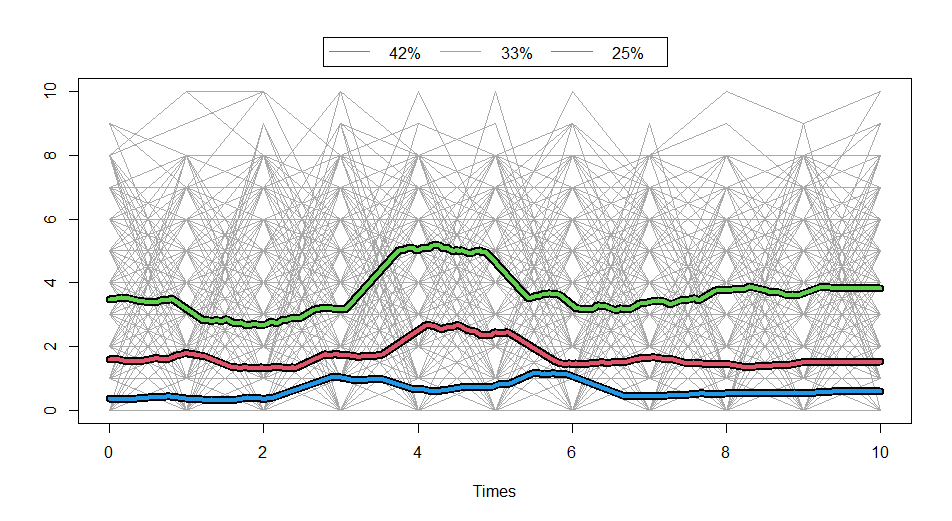


## Fixed Effects 

```{r}
library(plm)
```


### 200922-so-pivot_longer-complicated.R
preparatory work for next scripts... 

```{r}
df <- tibble(
  id = c(1,2,3),
  x02val_a = c(0,1,0),
  x03val_a = c(1,0,0),
  x04val_a = c(0,1,1),
  x02val_b = c(0,2,0),
  x03val_b = c(1,3,0),
  x04val_b = c(0,1,2),
  age02 = c(1,2,3),
  age03 = c(2,3,4),
  age04 = c(3,4,5)
)
df

df %>%
  pivot_longer(-id,names_to = c('.value', 'year'),names_pattern = '([a-z]+(\\d+)[a-z]+_[a-z])')

```


### 200922-script-fixed-effects.R
Not quite sure ... doesn't work on my machine... 3 different models are tried... 

$$\text{lme4::lmer(PF51 ~ PD29 + WSTAT + (year | ID) + (AGE | ID), lme_df)}$$

$$\text{plm(PF51 ~PD29+WSTAT, data=paneldata, model="within")}$$

$$\text{plm(PC17 ~ (PD29 + WSTAT), data=paneldata, model="within")}$$

```{r}
# imsbasics::clc()
# library(tidyverse)
# library(shp)
# library(kml)
# library(kmlShape)
# library(lubridate)
# library(plm)       # Panel data analysis library
# library(car)       # Companion to applied regression
# library(gplots)    # Various programing tools for plotting data
# library(tseries)   # For timeseries analysis
# library(lmtest)    # For hetoroskedasticity analysis
# library(lme4)
# 
# 
# data <- import_long_cols("P_USER.sav", "data/rawdata/Data SPSS/SHP-Data-W1-W21-SPSS",
#                          cols = c("IDPERS", "PYYF51", "PYYW229", "PYYC17", "AGEYY", "WSTATYY", "PYYD29"), 
#                          year_start = "2008", year_end = "2018")
# 
# data_complete <- data %>%
#   filter(complete.cases(.))
# 
# longer <- data_complete
# longer <- longer %>%
#   pivot_longer(-ID,
#                names_to = c('.value', 'year', '.value'),
#                names_pattern = '([A-Z]*)(\\d{2})([A-Z]*\\d*)') %>%
#   mutate(WSTAT = as.factor(WSTAT))
#   
# imsbasics::save_rdata(longer, "longer_script_200922", save_path, force = TRUE)
longer <- imsbasics::load_rdata("longer_script_200922", load_path)


lme_df <- longer %>%
  mutate(ID = as.factor(ID)) %>%
  mutate(year = as.numeric(year))

lme_df

# lme <- lme4::lmer(PF51 ~ PD29 + WSTAT + (year | ID) + (AGE | ID), lme_df)
# lme
# 
# paneldata <- pdata.frame(longer, index = c("ID", "year"))
# 
# fixed <- plm(PF51 ~PD29+WSTAT, data=paneldata, model="within")
# summary(fixed)
# fixed <- plm(PC17 ~ (PD29 + WSTAT), data=paneldata, model="within")
# summary(fixed)


# paneldata <- as.data.frame(paneldata)
# ggplot(paneldata) +
#   geom_line(aes(x = WSTAT, y = yhat, color = ID), show.legend = FALSE) +
#   geom_jitter(aes(x = WSTAT, y = yhat, color = ID), show.legend = FALSE) +
#   geom_smooth(aes(x = WSTAT, y = yhat), method = "lm", se = FALSE, show.legend = FALSE)

```
 
### 200923-script-fixed-effects-plm.R
preparatory work for next scripts... 


### 200923-rmd-fixed-effects-plm-depression-erschoepfung.Rmd {.tabset}

#### Datensatz 

Gemäss Dokument "Sample, Beanspruchungsfolgen, Belastungen"; Einzelne Variablen fehlen noch.

*Lesehilfe: Die Variablennamen werden verändert angezeigt, statt beispielsweise P08W87 (Variable W87 aus Fragebogen P im Jahr 2008) steht PW87. Allfällige Buchstaben am Ende des Variablennamens (PYYW71A) fehlen.*

*Lesehilfe 2: Im ersten Teil sind die ersten Zeilen des Datensatzes zu sehen, im zweiten Teil eine Zusammenfassung mit den Verteilungen*

```{r}
# data <- import_long_cols("P_USER.sav", "../data/rawdata/Data SPSS/SHP-Data-W1-W21-SPSS",
#                          cols = c("IDPERS", "PYYC17", "PYYF51", "PYYW71A", "PYYW77", "PYYW87", "PYYW91", "PYYW94", 
#                                   "PYYW100", "PYYW216", "PYYW229", "PYYW603", "PYYW604", "PYYW605", "PYYW606", 
#                                   "PYYD29", "PYYL11", "PYYF50", "PYYF52", "PYYC08", "PYYC11", "PYYC19A", "PYYF08"), 
#                          year_start = "2008", year_end = "2018")
# 
# longer <- data %>%
#   pivot_longer(-ID,
#                names_to = c('.value', 'year', '.value'),
#                names_pattern = '([A-Z]*)(\\d{2})([A-Z]*\\d*)')
# 
# imsbasics::save_rdata(longer, "longer_script_200923", save_path, force = TRUE)
longer <- imsbasics::load_rdata("longer_script_200923", load_path)

paneldata <- pdata.frame(longer, index = c("ID", "year"))

head(paneldata)
summary(paneldata)

pd <- paneldata %>% 
  select(-year) %>%
  pivot_longer(-ID, names_to = "variable", values_to = "value") %>%
  select(-ID)
ggplot(pd) + geom_boxplot(aes(y = value)) + facet_wrap(~variable, scales = "free_y") + 
  theme(axis.title.x=element_blank(),
        axis.text.x=element_blank(),
        axis.ticks.x=element_blank())
```


#### Ermüdung, Erschöpfung (Variable PYYF51) {.tabset}
Erschöpfung nach Arbeit um Sachen zu machen

##### plm()
```{r}
ermuedung <- plm(PF51 ~ PD29 + PW229 + PW71 + PW77 + PW87 + PW91 + PW94 + PW100 + PW216 + PW603 + PW604 + PW605 + PW606 + PL11 + PF08 + PF50 + PF52 + PC08 + PC11 + PC19, data=paneldata, model="within")
summary(ermuedung)

```

##### lm()
```{r}
erm_simple <- lm(PF51 ~ PD29 + PW229 + PW71 + PW77 + PW87 + PW91 + PW94 + PW100 + PW216 + PW603 + PW604 + PW605 + PW606 + PL11 + PF08 + PF50 + PF52 + PC08 + PC11 + PC19, data=paneldata)
summary(erm_simple)
```


#### Depression (Variable PYYC17) {.tabset}
Niedergeschlagenheit, Hoffnungslosigkeit, Angst, Depression: Häufigkeit

##### plm()
```{r}
depression <- plm(PC17 ~ PD29 + PW229 + PW71 + PW77 + PW87 + PW91 + PW94 + PW100 + PW216 + PW603 + PW604 + PW605 + PW606 + PL11 + PF08 + PF50 + PF52 + PC08 + PC11 + PC19, data=paneldata, model="within")
summary(depression)

```

##### lm()
```{r}
dep_simple <- lm(PC17 ~ PD29 + PW229 + PW71 + PW77 + PW87 + PW91 + PW94 + PW100 + PW216 + PW603 + PW604 + PW605 + PW606 + PL11 + PF08 + PF50 + PF52 + PC08 + PC11 + PC19, data=paneldata)
summary(dep_simple)
```


### 200928-script-vcrpart.R
Same models as in script before, but with functions `vcrpart::tvcglm()` --> package
is not avaiable on CRAN... Download manually if necessary. 

```{r}
# imsbasics::clc()
# library(tidyverse)
# library(shp)
# library(vcrpart)

# data <- import_long_cols("P_USER.sav", "data/rawdata/Data SPSS/SHP-Data-W1-W21-SPSS",
#                          cols = c("IDPERS", "PYYC17", "PYYF51", "PYYW71A", "PYYW77", "PYYW87", "PYYW91", "PYYW94", 
#                                   "PYYW100", "PYYW216", "PYYW229", "PYYW603", "PYYW604", "PYYW605", "PYYW606", "PYYD29", 
#                                   "PYYL11", "PYYF50", "PYYF52", "PYYC08", "PYYC11", "PYYC19A", "PYYF08"), 
#                          year_start = "2008", year_end = "2018")
# longer <- data %>%
#   pivot_longer(-ID,
#                names_to = c('.value', 'year', '.value'),
#                names_pattern = '([A-Z]*)(\\d{2})([A-Z]*\\d*)')
# 
# imsbasics::save_rdata(longer, "longer_script_200928", save_path, force = TRUE)
longer <- imsbasics::load_rdata("longer_script_200928", load_path)

paneldata <- pdata.frame(longer, index = c("ID", "year"))

# ermuedung <- plm(PF51 ~ PD29 + PW229 + PW71 + PW77 + PW87 + PW91 + PW94 + PW100 + 
# PW216 + PW603 + PW604 + PW605 + PW606 + PL11 + PF08 + PF50 + PF52 + PC08 + PC11 + PC19, 
# data=paneldata, model="within")
# summary(ermuedung)
# depression <- plm(PC17 ~ PD29 + PW229 + PW71 + PW77 + PW87 + PW91 + PW94 + PW100 + 
# PW216 + PW603 + PW604 + PW605 + PW606 + PL11 + PF08 + PF50 + PF52 + PC08 + PC11 + PC19, 
# data=paneldata, model="within")
# summary(depression)


# data1 <- longer
# data1 <- data1[1:100, ]
# 
# data1$PC17 <- .1 * data1$PC17
# tvcglm(PC17 ~ PD29 + PW229 + PW71 + PW77 + PW87 + PW91 + PW94 + PW100 + PW216 + 
# PW603 + PW604 + PW605 + PW606 + PL11 + PF08 + PF50 + PF52 + PC08 + PC11 + PC19, 
# data=data1, family = binomial())
# 
# data1$PF51 <- .1 * data1$PF51
# tvcglm(PF51 ~ PD29 + PW229 + PW71 + PW77 + PW87 + PW91 + PW94 + PW100 + PW216 + 
# PW603 + PW604 + PW605 + PW606 + PL11 + PF08 + PF50 + PF52 + PC08 + PC11 + PC19, 
# data=data1, family = binomial())
```

### 201020-rmd-paper-I-draft-v1.Rmd
See separate script. 


### 201021-fe-sandkasten.R 
Einfacher Vergleich von lm() und plm() 

```{r}
df <- tibble(
  year = rep(c(1,2,3,4), 3),
  id = c(1, 1, 1, 1, 2, 2, 2, 2, 3, 3, 3, 3),
  einkommen = c(4, 1, 2, 3, 3, 4, 5, 6, 2, 4, 2, 4),
  zufriedenheit = c(5, 2, 3, 4, 5, 6, 5, 6, 7, 8, 5, 6)
)

ggplot(df, aes(x = einkommen, y = zufriedenheit)) +
  geom_point(aes(color = id)) +
  geom_smooth(method = "lm", se = FALSE)

lm(zufriedenheit ~ einkommen, df)
plm(zufriedenheit ~ einkommen, df, model = "within")
```


### 201130-kml-fe-v1.R {.tabset}

KML-clustering (similar as in `200908-script-schritt1-clustering-wstat.R`) +  
fixed-effects model.


#### Clustering
```{r}
dep_clustering <- imsbasics::load_rdata("dep_clustering_200908", load_path)

# data <- import_long_cols("P_USER.sav", "data/rawdata/Data SPSS/SHP-Data-W1-W21-SPSS",
#                          cols = c("IDPERS", "PYYC17", "PYYF51", "PYYW71A", "PYYW77", "PYYW87", "PYYW91", "PYYW94", 
#                                   "PYYW100", "PYYW216", "PYYW229", "PYYW603", "PYYW604", "PYYW605", "PYYW606", "PYYD29",
#                                   "PYYL11", "PYYF50", "PYYF52", "PYYC08", "PYYC11", "PYYC19A", "PYYF08"), 
#                          year_start = "2008", year_end = "2018")
# longer <- data %>%
#   pivot_longer(-ID,
#                names_to = c('.value', 'year', '.value'),
#                names_pattern = '([A-Z]*)(\\d{2})([A-Z]*\\d*)') %>%
#   mutate(year = as.numeric(paste0("20", year)))
# imsbasics::save_rdata(longer, "longer_script_201130", save_path, force = TRUE)
longer <- imsbasics::load_rdata("longer_script_201130", load_path)


dep_clustering_rich <- left_join(dep_clustering, longer) %>%
  mutate(cluster = cluster_second_level) %>%
  select(-cluster_second_level)

# rm(list=setdiff(ls(), "dep_clustering_rich"))

paneldata <- pdata.frame(dep_clustering_rich, index = c("ID", "year"))

dep_clus_summary <- dep_clustering_rich %>%
  group_by(cluster) %>%
  rename(cluster = cluster) %>%
  summarise(percentage = round(n()/nrow(.)*100))

dep_clustering_min_median_max <- dep_clustering_rich %>%
  group_by(cluster, year) %>%
  summarise(ymin = quantile(depression, .25),
            ymedian = median(depression),
            ymax = quantile(depression, .75))

ggplot(dep_clustering_min_median_max, aes(x = year, y = ymedian, color = cluster)) +
  # geom_ribbon(aes(ymin = ymin, ymax = ymax, fill = cluster), alpha = 0.1) +
  geom_smooth(aes(fill = cluster), method = lm, se = FALSE) +
  scale_x_continuous(breaks = c(2008, 2010, 2015, 2017), minor_breaks = c(2008:2017)) +
  scale_y_continuous(limits = c(0,10), name = "depression level") +
  scale_color_discrete(name = "cluster", labels = paste0(dep_clus_summary$cluster,": ", dep_clus_summary$percentage, "%")) +
  guides(fill = FALSE)
```


#### plm General 

```{r}
depression <- plm(PC17 ~ PD29 + PW229 + PW71 + PW77 + PW87 + PW91 + PW94 + PW100 + 
                    PW216 + PW603 + PW604 + PW605 + PW606 + PL11 + PF08 + PF50 + 
                    PF52 + PC08 + PC11 + PC19, data=dep_clustering_rich, model="within")
summary(depression)

ermuedung <- plm(PF51 ~ PD29 + PW229 + PW71 + PW77 + PW87 + PW91 + PW94 + PW100 + 
                   PW216 + PW603 + PW604 + PW605 + PW606 + PL11 + PF08 + PF50 + 
                   PF52 + PC08 + PC11 + PC19, data=dep_clustering_rich, model="within")
summary(ermuedung)
```

#### plm Dep A
```{r}
dep_clustering_rich_a <- dep_clustering_rich %>% filter(cluster == "A")
depression_a <- plm(PC17 ~ PD29 + PW229 + PW71 + PW77 + PW87 + PW91 + PW94 + PW100 + PW216 + PW603 + PW604 + PW605 + PW606 + PL11 + PF08 + PF50 + PF52 + PC08 + PC11 + PC19, data=dep_clustering_rich_a, model="within")
summary(depression_a)
```

#### plm Dep C
```{r}
dep_clustering_rich_c <- dep_clustering_rich %>% filter(cluster == "C")
depression_c <- plm(PC17 ~ PD29 + PW229 + PW71 + PW77 + PW87 + PW91 + PW94 + PW100 + PW216 + PW603 + PW604 + PW605 + PW606 + PL11 + PF08 + PF50 + PF52 + PC08 + PC11 + PC19, data=dep_clustering_rich_c, model="within")
summary(depression_c)
```

#### plm Dep D
```{r}
dep_clustering_rich_d <- dep_clustering_rich %>% filter(cluster == "D")
depression_d <- plm(PC17 ~ PD29 + PW229 + PW71 + PW77 + PW87 + PW91 + PW94 + PW100 + PW216 + PW603 + PW604 + PW605 + PW606 + PL11 + PF08 + PF50 + PF52 + PC08 + PC11 + PC19, data=dep_clustering_rich_d, model="within")
summary(depression_d)
```

#### plm Dep D
```{r}
dep_clustering_rich_e <- dep_clustering_rich %>% filter(cluster == "E")
depression_e <- plm(PC17 ~ PD29 + PW229 + PW71 + PW77 + PW87 + PW91 + PW94 + PW100 + PW216 + PW603 + PW604 + PW605 + PW606 + PL11 + PF08 + PF50 + PF52 + PC08 + PC11 + PC19, data=dep_clustering_rich_e, model="within")
summary(depression_e)
```

